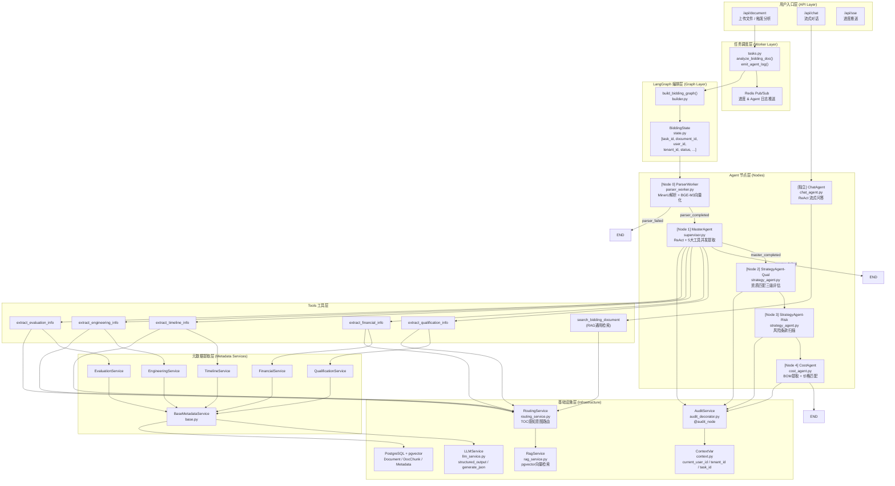

# bidding_sys Agent 架构深度分析报告

## 一、架构全景图



---

## 二、核心流程分解

### 2.1 离线分析流水线 (LangGraph Pipeline)

| 步骤 | 节点 | 职责 | 关键技术 |
|------|------|------|----------|
| 0 | `parser_worker_node` | 文件解析 → 切片 → 向量化 → 入库 TOC | MinerU + BGE-M3 + pgvector |
| 1 | `master_agent_node` | ReAct Agent 并发调用5大工具提取元数据 | `create_react_agent` + Tool Calling |
| 2 | `analyze_qualifications_node` | 资质三级评估（可做到/努力可做/做不到）| 结构化 JSON 输出 |
| 3 | `identify_risks_node` | 风险条款扫描（商务/法务/财务）| RAG 靶向探雷 |
| 4 | `cost_node` | BOM 提取 + 价格库语义匹配 | 价格参考库 CRUD |

条件边逻辑：
```
parser_worker → [parser_failed → END | parser_completed → master_agent]
master_agent  → [master_failed → END | master_completed → analyze_qualifications]
analyze_qualifications → identify_risks → cost_estimation → END
```

### 2.2 在线对话流 (ChatAgent)

```
用户问题 → ChatAgent.stream_chat()
    → create_react_agent(raw_llm, METADATA_TOOLS + RAG_TOOL)
    → astream_events() 流式事件监听
        → on_tool_start: 推送工具调用状态 + 记录 AuditLog
        → on_chat_model_stream: 推送 token
    → 汇总检索词 → RAG 溯源引文 → 推送 done 事件
```

---

## 三、亮点与优势

### ✅ 1. 双层 ReAct 架构设计合理

- **离线层**：`MasterAgent` 使用 `create_react_agent` + 5 大专项工具，实现元数据的**并发/迭代提取**，并内置了"自修正（Self-Correction）"机制：发现核心字段为 null 时，自动更换关键词重试，最多3次。
- **在线层**：`ChatAgent` 也是 ReAct 架构，支持流式输出，并能在回答后自动聚合引文来源（Citations）。

### ✅ 2. TOC 感知的动态意图路由 (RoutingService)

这是架构中最精妙的设计之一：
- 工具调用前，先让 LLM 分析标书目录树（TOC），判断查询词属于"局部知识"（特定章节）还是"全局知识"（全文检索）。
- 精准章节锁定 → 缩小向量检索范围 → 大幅降低幻觉风险。

### ✅ 3. 全链路审计系统 (`@audit_node` 装饰器)

每个 Agent 节点都被 `@audit_node` 装饰，自动记录：
- 执行时间、Token 消耗、输入输出、成功/失败状态
- 通过 `ContextVar` 传递 `task_id / node_name`，实现跨层追踪

### ✅ 4. 用户隔离安全机制

- 所有工具调用入口都经过 `validate_document_access(document_id)` 校验
- `ContextVar` 持有 `current_user_id / current_tenant_id`，在异步/多租户环境下安全隔离
- `RoutingService` 支持区分"用户级鉴权调用"和"系统级后台调用"两种模式

### ✅ 5. 元数据服务层设计

`BaseMetadataService` 提供统一的 **提取 → 落盘** 流水线：
- 统一的防幻觉提示词（宁缺毋滥、明确豁免）
- 自动 upsert 到 PostgreSQL（有则更新，无则创建）
- 5 个子类各自封装领域特定的 Pydantic Schema

---

## 四、潜在问题与改进建议

### ⚠️ 问题 1：`security.py` 中的访问控制存在"全拒绝"风险

```python
# security.py L16-17
if not user_id or not tenant_id:
    return False  # 直接拒绝！
```

**问题**：Master Agent 在后台任务中运行时，它会先通过 `state.get("user_id")` 设置 ContextVar，然后在 Tool 层读取。但如果 ContextVar 的传播链在某个环节断开（比如线程边界），`validate_document_access` 会直接返回 `False`，导致工具调用无声失败（返回拒绝访问字符串，LLM 可能无法识别这是一个权限错误）。

**建议**：
```python
# 改为区分"明确无身份（拒绝）"和"系统任务（允许）"两种模式
# 或者添加一个系统级白名单标志 ContextVar
is_system_task = current_is_system_task.get(False)
if is_system_task:
    return True
```

---

### ⚠️ 问题 2：`tasks.py` 中硬编码的 `tenant_id`

```python
# tasks.py L74
project = Project(tenant_id="default-tenant", ...)
# tasks.py L251
tenant_id="default-tenant",  # async_write_audit_log 中
```

**问题**：项目已经支持多租户，但审计日志写入和 Project 创建仍使用硬编码的 `"default-tenant"`，违反了多租户隔离原则。

**建议**：将 `tenant_id` 从上层传入，或从 `ContextVar` 中读取。

---

### ⚠️ 问题 3：`BiddingState` 缺少必要字段

```python
# state.py
class BiddingState(TypedDict):
    # 缺少 cost_analysis 字段声明！
    qualifications_analysis: Dict[str, Any]
    risks_analysis: List[Dict[str, Any]]
    cost_analysis: Dict[str, Any]  # ← 有，但需确认
```

实际运行时 `CostAgent` 返回 `{"cost_analysis": {...}}`，但 State 定义中是否声明了 `cost_analysis` 需要核实，否则 LangGraph 可能丢弃该字段。

---

### ⚠️ 问题 4：`graph/execution.py` 为空

```
graph/execution.py  # 0 bytes
```

这个文件是空的，原本应该放置什么逻辑？建议补充或删除。

---

### ⚠️ 问题 5：`rag_tools.py` 中 `section_titles` 类型混用

```python
# rag_tools.py L26
section_titles = routing_service.analyze_intent_and_route(document_id, query)
# ← 返回的是 RoutingDecision 对象，但下面直接作为 section_title 参数传入 RAG
# rag_service.search_bidding_document(section_title=section_titles, ...)
```

**问题**：`routing_service.analyze_intent_and_route()` 返回 `RoutingDecision` 对象，但代码把整个对象直接传给了 `rag_service` 的 `section_title` 参数（期望是 `List[str]` 或 `None`），类型不匹配。这个 bug 可能导致向量检索时章节过滤失效。

**建议**：
```python
decision = routing_service.analyze_intent_and_route(document_id, query)
section_titles = None if decision.is_global_search else decision.target_chapters
```

---

### ⚠️ 问题 6：LangGraph 图中缺少 `writer_agent` 节点

```
agents/nodes/writer_agent.py  # 文件存在，但未在 builder.py 中注册！
```

**问题**：`writer_agent.py` 文件存在但从未被注册进 LangGraph 图，是规划中的功能尚未集成？建议补全或添加注释说明。

---

### ⚠️ 问题 7：Master Agent 中直接使用 `agent.invoke()` 是同步阻塞

```python
# supervisor.py L100
agent_result = agent.invoke(inputs)  # 同步调用，会阻塞 Celery worker 线程
```

若 Celery 配置了 gevent/eventlet 异步并发池，同步 `invoke` 可能造成兼容性问题。若为进程池则无妨。

---

## 五、架构成熟度评分

| 维度 | 评分 | 说明 |
|------|------|------|
| Agent 设计模式 | ⭐⭐⭐⭐⭐ | ReAct + 工具调用 + 自修正 + 流式输出，设计完整 |
| 数据流与状态管理 | ⭐⭐⭐⭐ | LangGraph StateGraph 清晰，但 State 字段可更严格 |
| 安全与多租户隔离 | ⭐⭐⭐⭐ | ContextVar 方案好，但存在全拒绝边缘案例 |
| 可观测性与审计 | ⭐⭐⭐⭐⭐ | @audit_node 装饰器覆盖所有节点，审计完整 |
| 错误处理与降级 | ⭐⭐⭐⭐ | 条件边有失败终止逻辑，RoutingService 有异常降级 |
| 代码规范与可维护性 | ⭐⭐⭐⭐ | 分层清晰，但有空文件和未注册节点 |
| **综合** | **⭐⭐⭐⭐** | **生产可用，有几个值得修复的边缘问题** |

---

## 六、优先修复建议（按重要性排序）

1. **🔴 高优先级**：修复 `rag_tools.py` 中 `RoutingDecision` 对象直接传给 `section_title` 的类型错误
2. **🟠 中优先级**：修复 `tasks.py` 和 `async_write_audit_log` 中硬编码的 `"default-tenant"`
3. **🟠 中优先级**：为 `security.py` 添加系统任务绕过机制，避免后台任务工具调用被误拒绝
4. **🟡 低优先级**：决策 `writer_agent.py` 是否集成进 LangGraph 图
5. **🟡 低优先级**：清理或填充 `graph/execution.py` 空文件
