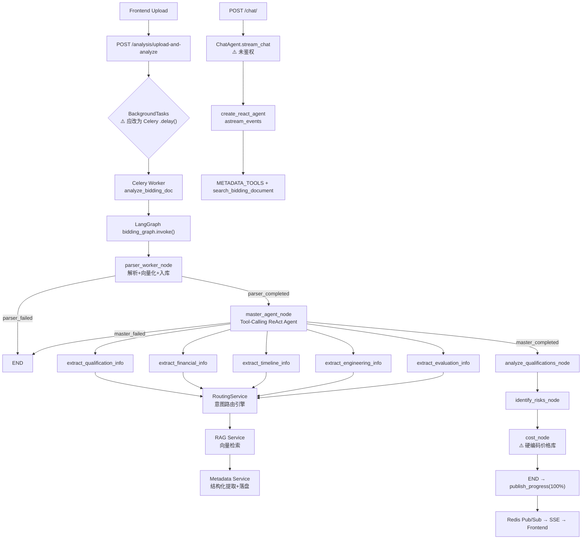

# 智能招投标系统 — Agent 架构合规性审查报告

> 审查时间：2026-07-21  
> 审查范围：`backend/app/` 全量代码  
> 评估标准：LangGraph 多 Agent 编排规范 + 项目 AGENTS.md 开发守则

---

## 总体评分

| 维度 | 评分 | 说明 |
|------|------|------|
| Agent 编排结构 | ✅ 良好 | LangGraph StateGraph 正确使用 |
| 状态管理 | ⚠️ 存在缺陷 | BiddingState 缺少多租户字段 |
| Tool Calling 设计 | ✅ 优秀 | METADATA_TOOLS 工具集设计合理 |
| 路由引擎 | ✅ 良好 | RoutingService 意图识别路由清晰 |
| 异步任务调度 | ⚠️ 存在问题 | 混用 Celery + BackgroundTasks |
| 分层架构合规 | ⚠️ 部分违规 | Nodes 内直接操作 DB，违反分层原则 |
| 多租户隔离 | ❌ 有缺陷 | supervisor/cost 节点未注入 tenant_id |
| 测试覆盖 | ⚠️ 不足 | Agent 相关测试极少 |

---

## ✅ 符合规范的部分

### 1. LangGraph 编排图结构正确
[builder.py](file:///d:/Myproject/bidding_sys/backend/app/graph/builder.py) 使用 `StateGraph` 正确构建了：
```
parser_worker → master_agent → analyze_qualifications → identify_risks → cost_estimation → END
```
- 条件边 (`add_conditional_edges`) 用于错误熔断，节点失败时直接 `END`，防止级联崩溃 ✅
- 全局单例 `bidding_graph` 在 Celery Worker 中复用，避免重复编译 ✅

### 2. ReAct Tool Calling Agent 设计合理
- [chat_agent.py](file:///d:/Myproject/bidding_sys/backend/app/agents/chat_agent.py) 使用 `create_react_agent` + `astream_events` 实现流式输出 ✅
- `on_tool_start` 事件拦截后向前端推送工具调用进度，用户体验好 ✅
- 5 个专项元数据提取工具 ([metadata_tools.py](file:///d:/Myproject/bidding_sys/backend/app/agents/tools/metadata_tools.py)) 各自独立，职责单一 ✅

### 3. RoutingService 意图路由引擎
[routing_service.py](file:///d:/Myproject/bidding_sys/backend/app/services/routing_service.py) 基于大纲 (TOC) 实现智能局部/全局搜索决策 ✅

### 4. 审计装饰器 + 上下文追踪
- `@audit_node` 装饰器统一记录节点执行时间和 Token 消耗 ✅
- `current_task_id` / `current_node_name` 用 `ContextVar` 实现全链路追踪 ✅

### 5. Parser Worker 的 DB-First 原则
[parser_worker.py](file:///d:/Myproject/bidding_sys/backend/app/agents/nodes/parser_worker.py) 只返回 `status` 给 State，不向 State 传递庞大文本，符合 "State 只传控制信号" 的设计理念 ✅

---

## ❌ 不符合规范的问题

### 问题 1：BiddingState 缺少多租户字段（严重）

**文件**: [state.py](file:///d:/Myproject/bidding_sys/backend/app/agents/state.py)

```python
class BiddingState(TypedDict):
    task_id: str
    document_id: str
    doc_text: str
    company_quals: str
    # ❌ 缺少 user_id 和 tenant_id！
```

**影响**：各个 Agent 节点（supervisor、cost_agent、strategy_agent）在内部都通过 `SessionLocal()` 直接查询 DB，没有任何租户过滤，存在数据越权风险。`analyze_bidding_doc` 任务接收了 `user_id` 和 `tenant_id`，但注入 `initial_state` 时没有把它们放进去。

**修复方案**：
```python
class BiddingState(TypedDict):
    task_id: str
    document_id: str
    user_id: str      # 新增
    tenant_id: str    # 新增
    doc_text: str
    company_quals: str
    ...
```
同时在 `tasks.py` 的 `initial_state` 中传入这两个字段。

---

### 问题 2：混用 Celery + BackgroundTasks（中等）

**文件**: [analysis.py](file:///d:/Myproject/bidding_sys/backend/app/api/endpoints/analysis.py)，第 60 行

```python
# ❌ 在 FastAPI 的 BackgroundTasks 里调用的是 Celery 任务函数
background_tasks.add_task(
    analyze_bidding_doc,  # 这是 @celery_app.task 装饰的函数
    ...
)
```

`analyze_bidding_doc` 是 `@celery_app.task` 装饰的函数。使用 `background_tasks.add_task()` 调用它时，只是普通地调用了该函数本身，并没有真正通过 Celery Worker 执行，也无法享受 Celery 的任务重试、分布式调度特性。

**修复方案**：应改为 `analyze_bidding_doc.delay(...)` 或 `analyze_bidding_doc.apply_async(...)` 来真正触发 Celery 任务。

---

### 问题 3：Agent Nodes 直接操作数据库，违反分层原则（中等）

**文件**: 
- [supervisor.py](file:///d:/Myproject/bidding_sys/backend/app/agents/supervisor.py) — 直接 `db.query(Document)`、`db.query(DocChunk)`
- [strategy_agent.py](file:///d:/Myproject/bidding_sys/backend/app/agents/nodes/strategy_agent.py) — 直接 `db.query(QualificationMetadata)`
- [cost_agent.py](file:///d:/Myproject/bidding_sys/backend/app/agents/nodes/cost_agent.py) — 直接 `db.query(Document)`、`db.query(DocChunk)`

**问题**：Agent Node 层（`agents/nodes/`）属于编排调度层，不应该直接接触数据库。这违反了"路由层/业务层/数据访问层严格分离"的规范（AGENTS.md 中明确要求）。

**修复方案**：将数据查询逻辑封装到 CRUD 或 Service 层：
- 创建 `document_crud.get_chunks_by_document_id(db, doc_id)`
- 创建 `metadata_crud.get_qualification_by_doc_id(db, doc_id)` 等

---

### 问题 4：supervisor.py 使用 `logging` 而非 `loguru`（轻微）

**文件**: [supervisor.py](file:///d:/Myproject/bidding_sys/backend/app/agents/supervisor.py) 第 1、11 行

```python
import logging  # ❌ 应使用 loguru
logger = logging.getLogger(__name__)
```

项目其他地方（如 `chat_agent.py`、`tasks.py`）统一使用 `from loguru import logger`。应统一风格。

---

### 问题 5：cost_agent 硬编码价格库（轻微）

**文件**: [cost_agent.py](file:///d:/Myproject/bidding_sys/backend/app/agents/nodes/cost_agent.py) 第 31-34 行

```python
# ❌ 硬编码演示数据
price_book = {
    "高性能服务器": 45000, 
    "千兆交换机": 3000
}
```

注释中也写明了"这里为了演示，硬编码一个简单的价格库"，但这个演示代码已经进入生产代码流中，会导致所有真实标书的成本测算结果失真。

---

### 问题 6：chat.py 未鉴权（严重）

**文件**: [chat.py](file:///d:/Myproject/bidding_sys/backend/app/api/endpoints/chat.py) 第 34 行

```python
@router.post("/")
async def chat_stream(request: ChatRequest):
    # ❌ 没有 Depends(deps.get_current_active_user)
```

聊天接口没有鉴权中间件保护，任何人只要知道 `document_id` 就可以向任意文档发起提问，存在数据泄露风险。

---

### 问题 7：strategy_agent 节点未使用 @audit_node 装饰器（轻微）

**文件**: [strategy_agent.py](file:///d:/Myproject/bidding_sys/backend/app/agents/nodes/strategy_agent.py) 第 12、82 行

```python
@audit_node(name="StrategyAgent-AnalyzeQualifications")
def analyze_qualifications_node(...):
    ...

@audit_node(name="StrategyAgent-IdentifyRisks")  
def identify_risks_node(...):
```

这两个节点确实有 `@audit_node`，但 `cost_node` 在 [cost_agent.py](file:///d:/Myproject/bidding_sys/backend/app/agents/nodes/cost_agent.py) 中没有 `@audit_node` 装饰，成本测算节点的执行无法被审计追踪。

---

## 改进建议汇总

| 优先级 | 问题 | 修复文件 |
|--------|------|---------|
| 🔴 严重 | chat.py 缺少鉴权 | `endpoints/chat.py` |
| 🔴 严重 | BiddingState 缺少 user_id/tenant_id | `agents/state.py`, `worker/tasks.py` |
| 🟡 中等 | BackgroundTasks 误用 Celery | `endpoints/analysis.py` |
| 🟡 中等 | Agent Nodes 直接操作 DB | `supervisor.py`, `strategy_agent.py`, `cost_agent.py` |
| 🟢 轻微 | supervisor.py 混用 logging | `supervisor.py` |
| 🟢 轻微 | cost_agent 硬编码价格库 | `cost_agent.py` |
| 🟢 轻微 | cost_node 缺 @audit_node | `cost_agent.py` |

---

## 架构整体流程图


