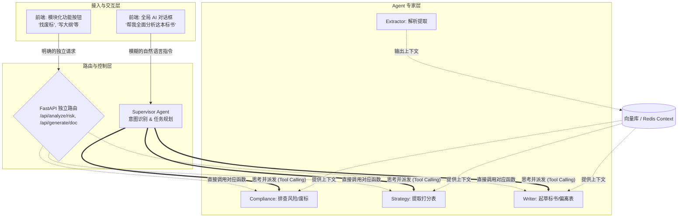

# 智能投标辅助系统 (Bidding Sys) 后端架构设计

本设计结合了当前 AI 领域最火热且经过生产验证的 **Agentic Workflow (智能体工作流)**、**Multi-Agent (多智能体协作)** 以及 **RAG (检索增强生成)** 技术，构建一个高并发、可扩展、智能化的后端架构。

## 1. 整体架构分层

我们将后端分为四大核心层：
1. **接入层 (API & Realtime)**：基于 FastAPI 提供 RESTful API，并利用 WebSocket/SSE 提供实时进度推送。
2. **调度与工作流层 (Orchestration)**：基于 Celery 做耗时任务的异步调度；基于 **LangGraph** 或自研状态机实现多 Agent 的工作流编排。
3. **AI 与业务逻辑层 (Multi-Agent System)**：系统的“大脑”，由多个各司其职的专有智能体（Agent）组成。
4. **数据与基础设施层 (Infrastructure)**：包括关系型数据库、向量数据库、对象存储和缓存。

---

## 2. AI 架构：多智能体协作 (Multi-Agent System)

面对极其复杂的长文本（几十上百页的招标文件），单一的 LLM 调用（Prompt Engineering）极易出现“幻觉”或“遗忘”。我们将系统拆分为**专家委员会模式**：

*   **🕵️ 拆解与提取智能体 (Extractor Agent)**
    *   **职责**：负责调用 OCR 和 PDF 解析工具（如 PyMuPDF, Camelot），将非结构化文档拆解为文本块、表格数据，并进行初步的结构化清洗。
*   **👮 合规与排雷智能体 (Compliance Agent)**
    *   **职责**：专门带着“找茬”的目的，在文档中扫描带 `*` 号的“废标项”、“实质性要求”以及各类违约金条款。
*   **🧑‍🏫 策略与计分智能体 (Strategy Agent)**
    *   **职责**：专门寻找“评标办法”章节，提取打分表（如价格30%、技术50%），并根据打分表生成“高分策略”和所需业绩清单。
*   **👨‍💻 标书撰写智能体 (Writer Agent)**
    *   **职责**：根据“投标文件格式”要求，提取大纲；并结合公司知识库，自动生成技术/商务偏离表及标书草稿内容。
*   **🛠️ 工具与技能总线 (Tool/Skill Bus)**
    *   每个 Agent 都可以调用外部工具（Function Calling），例如“查询市场历史价格”、“检索公司资质库”。

---

## 3. 核心机制：RAG 与长文本处理

针对“与 PDF 交互问答”以及“结合公司资质写标书”的需求：
*   **文档切片与向量化 (Document Chunking & Embedding)**：将招标文件按语义段落切片，使用 Embedding 模型转化为向量。
*   **双路召回与重排 (Hybrid Search & Rerank)**：结合传统的关键词检索（BM25）与向量检索（Dense Retrieval），再通过 Rerank 模型进行重排，确保大模型回答时引用的条款 100% 准确，杜绝幻觉。
*   **企业知识库对接**：预先将公司的所有资质文件、历史高分标书存入向量数据库。当 Writer Agent 写偏离表时，直接从库中 RAG 检索对应话术。

---

## 4. 后端技术栈选型

| 模块 | 技术选型 | 选用理由 |
| :--- | :--- | :--- |
| **核心框架** | **FastAPI** | Python 生态最高效的异步 Web 框架，自带 Pydantic 数据验证和自动生成的 OpenAPI 文档。 |
| **异步任务队列** | **Celery + Redis** | 招标文件解析和多 Agent 推理可能耗时 3~10 分钟，必须完全剥离到后台异步执行。 |
| **实时通讯** | **Server-Sent Events (SSE) / WebSocket** | 用于将后台 Agent 思考的过程、解析进度（如“正在提取废标项...”）实时打字机般推送给前端展示。 |
| **Agent 编排** | **LangGraph / LlamaIndex Workflows** | 擅长处理复杂的、有环的智能体图状结构，适合需要“反思-重试”的逻辑。 |
| **数据库 (关系型)** | **PostgreSQL** | 存储用户、项目、权限、结构化了的 BOM 清单及分析结果。（建议替换当前的 SQLite） |
| **数据库 (向量)** | **Milvus / Qdrant / PGVector** | 存储文档切片向量，支撑 RAG。若追求极简部署，可直接在 PostgreSQL 开启 `pgvector` 插件。 |
| **对象存储** | **MinIO (S3 兼容)** | 存储用户上传的 PDF 原件、AI 截取的表格图片、生成的 Word 文档。 |
| **大模型接口** | **OpenAI API 标准封装** | 业务代码仅依赖统一接口，底层可随时热切换为 DeepSeek、通义千问、Kimi 等更擅长中文长文本的模型。 |

---

## 5. 核心业务工作流与 Agent 编排：混合路由架构 (Hybrid Routing Architecture)

为了兼顾“极速的按需响应”与“极度的智能化”，系统将采用**“UI 工具箱（按需触发） + 智能包包工头（Supervisor）”**相结合的混合架构。底层的各个 Agent 将被封装为独立的、无状态的“微服务化工具（Skills/Tools）”。

### 架构设计图

### 混合架构如何运作？

1. **统一的 Agent 专家层 (底层)**：
   我们编写的 `ComplianceAgent`, `StrategyAgent` 等，不再是死板的流程节点，而是变成了一个个标准的 Python 函数或类，并被注册为大模型的“工具 (Tools)”。它们通过读取 Redis 或数据库中的 `BiddingState` 上下文来进行工作。
2. **玩法一：UI 工具箱直达 (API Routes)**：
   当用户在前端明确点击“排查废标项”按钮时，前端调用 FastAPI 的 `/api/analyze/risk` 接口。该接口**绕过 Supervisor**，直接实例化并运行 `ComplianceAgent`。这种方式速度极快，没有意图识别的开销，结果瞬间返回。
3. **玩法二：全局智能助理 (Supervisor)**：
   当用户在右侧的 AI 聊天窗口输入：“帮我把废标项找出来，然后告诉我怎么拿高分。” 前端调用 `/api/chat/supervisor` 接口。
   * **Supervisor** 接收到自然语言，利用大模型的 Reasoning 能力分析出需要执行两步。
   * 它通过 Function Calling，自动先调用 `ComplianceAgent` 对应的函数，再调用 `StrategyAgent` 对应的函数。
   * 最后，Supervisor 汇总两个专家的结果，用自然语言回答给用户。

### Agent 之间如何沟通与协作？

在多智能体架构中，Agent 之间的交流不像人类那样“聊天”，而是通过以下三种极其高效的计算机机制：

1. **“黑板模式”共享状态 (Shared State)**：
   * 想象所有 Agent 围着一块大黑板（这就是 LangGraph 里的 `State` 对象，本质是一个巨大的 Python 字典/JSON）。
   * `Extractor Agent` 干完活，把解析好的文本“写”在黑板的 `pdf_content` 区域。
   * `Writer Agent` 开始工作时，不需要去问 `Extractor`，它直接抬头看黑板，读取 `pdf_content` 和别人写在上面的 `risk_items`，然后开始写标书。
2. **老板派单与结果汇报 (Message Passing / Tool Calling)**：
   * 当采用 Supervisor 模式时，采用的是上下级派单模式。
   * Supervisor 发送系统消息（Prompt + 参数）给 `Compliance Agent`：“你的任务是查废标，文件 ID 是 123”。
   * `Compliance Agent` 查完后，并不需要和其他平级 Agent 沟通，而是将一份标准的 JSON 报告返回给 Supervisor。Supervisor 拿到所有报告后，再决定下一步给谁派单。
3. **记忆外脑共享 (RAG / Database)**：
   * 某些分析极其庞大，不可能全塞进消息里。这时，它们通过**向量数据库（Milvus/PGVector）**交流。
   * 例如：`Extractor` 将长达 200 页的标书切片存入向量库。`Strategy Agent` 需要找打分表时，直接拿“评标办法”这四个字去向量库里检索（RAG），瞬间获取相关段落。这种通过外脑数据库的“异步交流”，彻底解决了大模型上下文受限的问题。

### 这种设计的巨大优势：
* **底层代码高度复用**：无论是 UI 按钮点击，还是 Supervisor 聊天触发，后端执行的**底层 Agent 逻辑代码是同一套**，极易维护。
* **渐进式的用户体验**：新手用户可以通过聊天框让 Supervisor 带着走，高级用户（标书老手）可以直接点按钮快速索取特定模块的结果，互不干涉。

## User Review Required

1. **数据库迁移**：目前项目使用的是 SQLite。在引入高并发的异步任务和向量检索时，建议我们将主数据库升级为 **PostgreSQL**（可集成 pgvector，省去独立部署向量库的麻烦）。你是否同意采用 PostgreSQL？
2. **大模型选型**：由于招标文件动辄几万字，我们需要支持**超长上下文（Long Context）**的模型。目前国内处理长文本性价比极高的是 **DeepSeek-Chat** 或 **Kimi (Moonshot)**。前期开发我们是否优先接入这些国产长文本模型？

## Open Questions

1. 关于**对象存储**，我们是在服务器上自建 MinIO，还是打算直接使用阿里云 OSS/腾讯云 COS 等云服务？
2. 团队目前是否有熟悉的 AI 编排框架（如 LangChain/LangGraph），还是希望我们尽量手写轻量级的 Agent 调度代码，以降低学习成本？
