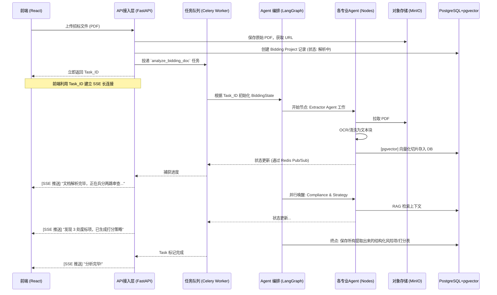

# 代码架构设计 (Code Architecture Design)

在确立了“FastAPI + Celery + LangGraph + PostgreSQL + MinIO”的技术栈，以及“混合路由 (Supervisor + 按需)”的多智能体协作模式后，现将整体代码架构的目录层级和组件边界规范如下：

## 1. 后端目录结构设计 (`backend/app/`)

为了保证代码的高内聚、低耦合，并契合 Agentic Workflow 的特点，项目采用领域驱动设计（DDD）思想的变体进行分层：

```text
backend/app/
├── api/                   # [接入层] FastAPI 路由控制器
│   ├── endpoints/         # 具体的业务接口 (如: auth, projects, document)
│   ├── routers.py         # 路由聚合
│   └── sse.py             # Server-Sent Events (SSE) 实时推送逻辑
├── core/                  # [核心配置层] 
│   ├── config.py          # 环境变量与应用配置
│   ├── security.py        # 认证与授权逻辑
│   ├── exceptions.py      # 全局异常捕获处理
│   └── celery_app.py      # Celery 实例初始化
├── db/                    # [数据访问层]
│   ├── session.py         # 数据库连接池 (PostgreSQL + pgvector)
│   ├── models/            # SQLAlchemy ORM 数据模型
│   └── crud/              # 数据库原子操作 (Create, Read, Update, Delete)
├── schemas/               # [数据校验层] Pydantic Data Models (DTOs)
│   ├── request/           # 进站请求校验
│   └── response/          # 出站响应格式化
├── services/              # [传统业务逻辑层]
│   ├── auth_service.py    # 登录/鉴权业务
│   ├── project_service.py # 招标项目 CRUD
│   └── file_service.py    # MinIO 对象存储交互逻辑
├── agents/                # [★ AI 核心层: 多智能体工作流]
│   ├── state.py           # LangGraph 的全局状态定义 (BiddingState)
│   ├── supervisor.py      # 总控 Agent (意图识别与任务分发)
│   └── nodes/             # 各专业领域 Agent 的逻辑封装
│       ├── extractor_agent.py   # 拆解与提取 Agent
│       ├── compliance_agent.py  # 合规排雷 Agent (废标项)
│       ├── strategy_agent.py    # 策略计分 Agent (打分表)
│       ├── cost_agent.py        # 成本报价 Agent (BOM/BOQ 测算)
│       └── writer_agent.py      # 标书撰写 Agent (生成 Word)
├── skills/                # [★ 核心资产层: 沉淀的专用技能库]
│   ├── base.py            # 技能基类与注册机制
│   ├── ocr_skill.py       # PDF解析、表格抽取技能
│   └── erp_skill.py       # (未来扩展) 内部 ERP 查询技能
├── graph/                 # [★ 工作流编排层]
│   ├── builder.py         # LangGraph 状态图的组装与编译
│   └── execution.py       # 执行 Graph，并将中间过程通过 Redis/Celery 上报
└── worker/                # [异步任务层]
    └── tasks.py           # 注册到 Celery 的长时间后台任务

backend/tests/             # [测试隔离层] 独立于 app 的自动化测试套件
├── conftest.py            # 全局测试配置与夹具 (Fixtures)
├── unit/                  # 单元测试 (测试单个函数/类)
├── integration/           # 集成测试 (测试 DB/Redis 连通性)
├── api/                   # 接口测试 (基于 httpx.AsyncClient)
└── fixtures/              # 测试假数据 (JSON 字典)
```

## 2. 核心组件交互链路图



## 3. 设计规范要求

1. **状态隔离**：`agents/nodes/` 下的各个 Agent 代码（如 `compliance.py`）必须是**无状态**的纯函数或类，所有的上下文输入与输出必须严格依赖传递进来的 `BiddingState`。
2. **长连接解耦**：Agent 在执行过程中，绝对不能直接操作 HTTP/SSE 连接。Agent 只负责写日志或向 Redis 推送中间事件，由外围的 FastAPI/Celery 统一收集并转成 SSE 吐给前端，保证 AI 核心层的纯粹性。
3. **重试机制**：由于 DeepSeek 大模型的请求可能因网络或限流失败，所有的 Agent 调用（特别是涉及大模型 API 请求的地方）必须引入 `tenacity` 等库进行重试兜底设计。
4. **统一响应**：API 层所有的返回，必须封装为统一的 `{'code': 200, 'message': 'success', 'data': {}}` 格式。

## 4. 技能插件化扩展机制 (Skill Plugin Mechanism)

为了实现需求中的“AI 技能插件系统 (Skill Mechanism)”，我们在架构中将大模型的 **Function Calling (函数调用)** 能力进行标准化封装，确保后期能随时实现热插拔。

### 4.1 技能定义位置 (`backend/app/skills/`)
为了方便后期你沉淀和复用核心资产，我们在后端专门独立出了一个高优先级的 `skills/` 目录。
这里不仅仅是放几个函数，你可以把它当做你的**企业 AI 资产库**。每一个 Skill 都是一个独立的模块，打上了特定装饰器（如 LangChain 的 `@tool`）。

```python
# app/skills/erp_skill.py
from langchain_core.tools import tool

@tool
def query_erp_inventory(product_name: str) -> dict:
    """查询内部 ERP 系统，获取特定产品的库存和底价。
    当标书中要求评估供货能力和报价时调用此技能。
    """
    # ... 连接企业内部 ERP 数据库的逻辑 ...
    return {"stock": 100, "base_price": 50.0}
```

### 4.2 Agent 动态挂载技能
在 `agents/nodes/` 的具体 Agent 实现中，我们在初始化模型时，把你沉淀在 `skills/` 目录下的技能“喂”给大模型（如 DeepSeek）：

```python
# app/agents/nodes/strategy.py
from app.skills.erp_skill import query_erp_inventory
from app.skills.web_skill import search_latest_law

# 动态配置当前 Agent 能使用的技能
available_skills = [query_erp_inventory, search_latest_law]

# 模型绑定技能
llm_with_skills = llm.bind_tools(available_skills)
```

### 4.3 为什么这样设计极具扩展性？
1. **独立沉淀**：独立的 `skills/` 目录让你后期积累的技能一目了然。未来你想增加一个“查天眼查公司信用”的技能，只需要在 `skills/` 里新建一个 `tianyancha_skill.py` 文件，写个几行的 Python 函数即可。
2. **职责分离**：核心的 Agent 控制逻辑不需要做任何修改，避免了牵一发而动全身的代码灾难。
3. **安全可控**：我们可以为不同的 Agent 挂载不同的技能权限。例如 `Writer Agent` 只能用“查询”类技能，没有“删除”或“支付”类技能，保证系统安全。

---

## 5. 前端架构设计 (Frontend Architecture Design)

为了与强大的后台 AI 编排相呼应，前端需要提供**极具沉浸感、响应式且美观**的 B 端用户体验。项目已初始化为 **Vite + React (TypeScript) + Tailwind CSS** 技术栈。

### 5.1 前端目录结构设计 (`frontend/src/`)

```text
frontend/src/
├── assets/                # 静态资源 (图片、字体)
├── components/            # [UI 基础层] 可复用的基础组件
│   ├── ui/                # 按钮、输入框、模态框、骨架屏 (推荐引入 shadcn/ui)
│   ├── chat/              # 聊天气泡、输入区、消息列表 (配合 Supervisor)
│   └── feedback/          # 进度条、Toast 提示
├── features/              # [业务模块层] 按照业务域划分模块
│   ├── document/          # 标书上传与解析组件 (UploadBox, PDFViewer)
│   ├── risk/              # 废标项排查结果展示视图
│   ├── strategy/          # 打分策略与成本测算图表
│   └── writer/            # 标书大纲生成与偏离表预览
├── hooks/                 # [逻辑层] 自定义 React Hooks
│   ├── useSSE.ts          # ★ 核心: 封装 Server-Sent Events 连接，接收后端实时状态
│   └── useAgent.ts        # 封装对后端 FastAPI 的请求逻辑
├── store/                 # [状态层] 全局状态管理 (Zustand)
│   └── useBiddingStore.ts # 存储当前标书分析状态、聊天记录、高亮内容
├── styles/                # [样式层] 全局 CSS 与 Tailwind 配置
└── App.tsx                # 应用主入口与路由配置
```

### 5.2 核心交互设计：如何适配“混合路由”后端？

我们的后端采用了“UI 工具箱 + Supervisor 智能助理”混合模式，前端界面也需要对应设计为“双主轴”：

1. **左侧/核心工作区 (UI 工具箱)**：
   * 展示解析后的标书目录、PDF 预览、以及结构化的分析结果面板（比如用红色高亮展示“废标项”、用表格展示“成本测算”）。
   * 提供明确的功能按钮组：`[提取废标项]`, `[生成打分策略]`, `[起草偏离表]`，点击直接调用后端指定的 API (On-Demand)。
2. **右侧/浮动区 (Supervisor 智能助理)**：
   * 类似 Copilot 的侧边栏对话框。用户可以在这里随时向 Supervisor Agent 提问：“这个项目的付款条件合理吗？”或者下达复杂指令。
3. **实时进度反馈 (SSE)**：
   * 当用户触发一个需要长耗时的 Agent 任务时，前端通过 `useSSE.ts` hook 与后端建立连接。
   * 界面上方或侧边栏显示一个**动态进度条或打字机终端**，实时输出：`"🕵️ 正在拆解文档..." -> "👮 正在寻找废标项 (发现2处)..."`。消除用户的等待焦虑。

### 5.3 前端技术选型细化

* **状态管理**: 推荐使用 **Zustand**。相比 Redux 更轻量，非常适合管理 SSE 不断涌入的零散状态更新。
* **UI 组件库**: 推荐使用 **shadcn/ui** 或 **Radix UI** + Tailwind CSS。它们能让你以极小的代价构建出现代化、高品质（玻璃拟物化、深色模式）的 B 端界面，且完全可定制。
* **数据可视化**: 推荐使用 **Recharts**，用于生成美观的“评分比重雷达图”或“成本预估柱状图”。

---

## 6. 测试架构规范 (Testing Architecture)

为了保证这套庞大且复杂的 AI 系统的稳定性，我们在架构层面将测试视为一等公民，并确立了严格的规范（详情已写入 `.agents/AGENTS.md`）：

### 6.1 物理隔离与解耦
所有的测试代码**绝不**与业务代码混杂，统一存放在 `backend/tests/` 独立目录下。
* 严禁在测试代码中硬编码庞大的测试数据，所有 Mock 数据必须存入 `tests/fixtures/` 以 JSON 形式独立维护。

### 6.2 异步优先测试
由于 FastAPI 和大模型调用大量使用 Python 的 `async/await`，我们的测试架构强依赖于 `pytest-asyncio`。
* 测试 HTTP 接口时，完全摒弃传统的 `TestClient`，强制统一使用无阻塞的 `httpx.AsyncClient`。

### 6.3 覆盖率基线要求
针对 `agents/` 下的复杂业务逻辑，单元测试必须满足三位一体覆盖：**正常路径、异常路径、边界条件**，确保底层 Agent 逻辑的绝对健壮。
