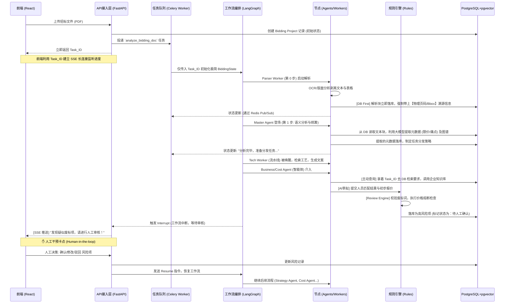

# 代码架构设计 (Code Architecture Design)

在确立了“FastAPI + Celery + LangGraph + PostgreSQL + MinIO”的技术栈，以及“混合路由 (Supervisor + 按需)”的多智能体协作模式后，现基于“DB First、严格溯源、人工决策”的核心准则，将整体代码架构的目录层级和组件边界规范如下：

## 1. 后端目录结构设计 (`backend/app/`)

为了保证代码的高内聚、低耦合，并契合 Agentic Workflow 的特点，项目采用领域驱动设计（DDD）思想的变体进行分层：

```text
backend/app/
├── api/                   # [接入层] FastAPI 路由控制器
│   ├── endpoints/         # 具体的业务接口 (如: auth, projects, document)
│   ├── routers.py         # 路由聚合
│   └── sse.py             # Server-Sent Events (SSE) 实时推送逻辑
├── core/                  # [核心配置层] 
│   ├── config.py          # 环境变量与应用配置
│   ├── security.py        # 认证与授权逻辑
│   ├── exceptions.py      # 全局异常捕获处理
│   └── celery_app.py      # Celery 实例初始化
├── db/                    # [数据访问层]
│   ├── session.py         # 数据库连接池 (PostgreSQL + pgvector)
│   ├── models/            # SQLAlchemy ORM 数据模型 (必须包含页码、坐标等溯源字段)
│   └── crud/              # 数据库原子操作 (Create, Read, Update, Delete)
├── schemas/               # [数据校验层] Pydantic Data Models (DTOs)
│   ├── request/           # 进站请求校验
│   └── response/          # 出站响应格式化
├── services/              # [传统业务逻辑层]
│   ├── auth_service.py    # 登录/鉴权业务
│   ├── project_service.py # 招标项目 CRUD
│   └── file_service.py    # MinIO 对象存储交互逻辑
├── rules/                 # [★ 规则引擎层: 程序校验] (核心红线拦截机制)
│   ├── compliance_rules.py# 资质红线硬性校验 (例如: 注册资本、资质等级)
│   ├── cost_rules.py      # 成本底线与利润率计算公式校验
│   └── review_engine.py   # [Rule Engine] Review Agent 合规与红线熔断器 (废标词/限价卡点)
├── agents/                # [★ AI 核心层: 混合智能体与流水线工作流]
│   ├── state.py           # LangGraph 的极简状态定义 (仅保留 Task ID 和游标，拒绝数据堆积)
│   ├── supervisor.py      # [True Agent] Master Agent 总控智能体 (解析与分发)
│   └── nodes/             # 节点封装 (严格区分自主 Agent 与受控 Worker)
│       ├── parser_worker.py     # [Pipeline] Document Parser 文档解析节点 (PDF转结构化+溯源坐标)
│       ├── business_agent.py    # [True Agent] Business & Qual 商务与资质专家 (业绩筛选与人员匹配)
│       ├── cost_agent.py        # [True Agent] Cost Estimation 报价计算专家 (动态调价与数学约束)
│       ├── tech_worker.py       # [Pipeline] Tech Solution 技术方案专家 (RAG与专项文案生成)
│       └── service_worker.py    # [Pipeline] Service & Training 售后服务专家 (格式化承诺生成)
├── skills/                # [★ 核心资产层: 沉淀的专用技能库]
│   ├── base.py            # 技能基类与注册机制
│   ├── ocr_skill.py       # PDF解析、表格抽取技能
│   └── erp_skill.py       # (未来扩展) 内部 ERP 查询技能
├── graph/                 # [★ 工作流编排层]
│   ├── builder.py         # LangGraph 状态图的组装与编译 (包含 Interrupt 节点)
│   └── execution.py       # 执行 Graph，通过 Celery 上报
└── worker/                # [异步任务层]
    └── tasks.py           # 注册到 Celery 的长时间后台任务

backend/tests/             # [测试隔离层] 独立于 app 的自动化测试套件
├── conftest.py            # 全局测试配置与夹具 (Fixtures)
├── unit/                  # 单元测试 (测试单个函数/类)
├── integration/           # 集成测试 (测试 DB/Redis 连通性)
├── api/                   # 接口测试 (基于 httpx.AsyncClient)
└── fixtures/              # 测试假数据 (JSON 字典)
```

### 1.1 核心节点职责定义与分类 (Role Definitions)

基于招投标业务的六大核心模块，根据其是否需要自主规划和工具调用，我们在架构上将其严格划分为以下三类：

#### 类别一：真正的智能体 (True Agents)
具备“自主思考、反复试探、调用工具”能力的节点，是系统的业务大枢纽。
* **Master Agent (总控智能体)**：位于 `supervisor.py`。作为流水线的首个核心大脑（第 1 步），核心职责为：
  1. **感知全局**：第一时间读取前置节点生成的《标书章节大纲 (TOC)》。
  2. **深度检索**：具备 Tool-Calling 能力，根据大纲自主调用高级 RAG 工具（`search_document_tool`）对技术规范等深层章节进行“排雷”，挖掘隐蔽的特殊工况与痛点。
  3. **核心元数据提取**：精准提取 4 大核心情报：项目编号、控制价限价（作为后续 Cost Agent 的红线卡点）、硬性资质、特殊痛点工况（附带页码与章节出处）。
  4. **强行落库 (DB First)**：将提取情报立刻写入 `Document.parsed_metadata`，彻底消除下游节点（如 Business、Cost、Tech）的盲目性，为全流程分发奠定“知己知彼”的基础。
* **Business & Qualification Agent (商务与资质专家)**：位于 `business_agent.py`。负责一、二、三、四、九、十部分的生成。自主调用公司数据库技能，精准筛选刚好满足评分要求的历史业绩（如“凑满 5 个光伏业绩拿满 10 分”），并自动匹配具备指定证书的人员。
* **Cost Estimation Agent (报价计算专家)**：位于 `cost_agent.py`。负责五、六部分的动态报价平衡。设定硬性数学约束（`总价 <= 限价`），若综合报价超标，能自主触发反馈循环，削减利润率或调整辅材报价重新计算。

#### 类别二：大模型驱动的流水线 (LLM Workers)
无决策权，专门负责高质量文本转化与生成的节点。
* **Document Parser Worker (文档解析节点)**：位于 `parser_worker.py`。这是所有流程的“第 0 步”。专门负责调用 OCR、版面分析模型，将几百页的 PDF 标书剥离成带物理页码、Bbox 坐标的结构化文本块，并第一时间落入 PostgreSQL，是实现“溯源”的基石。解析完毕后，才交由 Master Agent 进行高级抽象提取。
* **Technical Solution Agent (技术方案专家)**：降级为 `tech_worker.py`。负责第八部分。执行高级 RAG 流程：从向量库检索标准施工工艺，并专门调用 LLM 生成特定痛点（如“彩钢瓦换瓦”、“跨河敷设”）的专项技术文案。
* **Service & Training Agent (售后服务专家)**：降级为 `service_worker.py`。负责第五章售后部分。执行格式化生成，将“4小时答复”等要求升级为标书服务承诺，并生成驻站培训大纲。

#### 类别三：非 AI 规则引擎 (Rule Engines / Circuit Breakers)
涉及资金红线与合规废标项，绝不能由 LLM 凭空判断。
* **Review Agent (合规与红线智能体)**：降级为纯代码逻辑，移入 `rules/review_engine.py`。充当“检察官”，进行废标词扫描、单一品牌强制校验、偏离表交叉比对，并在总价突破限价（如 1181380 元）时直接触发系统熔断打回重算。

## 2. 核心组件交互链路图

根据“DB First”和“人工审核卡点”原则重构链路：



## 3. 四大核心架构原则 (Architecture Principles)

本项目代码开发必须严格遵循以下四条底线要求：

1. **区分智能体与流水线节点 (Agent vs Worker)**：
   * **隔离自主性**：架构上必须明确区分具有自主规划和工具调用能力的“真正智能体 (True Agent)”（如 Supervisor、Cost Agent），以及仅执行确定性逻辑或单一提示词的“流水线节点 (Pipeline Worker)”（如 Extractor、Writer）。
   * **降级以保安全**：为了保证高合规要求系统的安全性，凡是涉及信息提取和红线判定等容错率极低的环节，刻意将其设计为剥夺决策权的 Worker 节点，交由代码规则兜底。
2. **AI 负责草拟，程序负责校验，人工负责决策**：
   * **严禁 AI 独裁**：任何涉及成本测算、资质红线判定、版面最终生成的工作，严禁由大模型自主生成并直接采用。
   * **校验与卡点机制**：Agent/Worker 的输出只能作为“草稿”。草稿必须输入到代码层的 `rules/` 引擎中进行硬逻辑校验。涉及到高风险决策时，LangGraph 必须设置 `Interrupt` 中断点，将控制权交还前端，必须经过明确的**人工确认 (Human Approval)** 才能推进流转。
3. **万物皆可溯源 (Traceability)**：
   * **输入溯源**：在解析阶段，提取入库的每一条“要求 (Requirement)”，其数据模型中必须包含精确定位信息（`page_num`, `chapter_id`, `text_block_bbox`）。
   * **输出溯源**：AI 生成的每一条“响应 (Response)”和标书偏离表，必须提供强关联的外键或引证字段，直接指向企业内部真实的“资产证据库 (Evidence)”，坚决杜绝模型产生毫无根据的幻觉。
4. **状态持久化优先 (DB First)**：
   * **拒绝臃肿流转**：废弃传统 LangGraph 教程中将大量文档文本塞入 `State` 在节点间流转的模式。
   * **极简 State**：本项目中的 `BiddingState` 仅维护基础编排信息（如 `task_id`, `current_cursor`）。
   * **落库为安**：所有业务数据（解析结果、中间评估、草稿等）必须在生成后的第一时间通过 CRUD 写入 PostgreSQL。后续节点需要数据时，必须凭借 `task_id` 向数据库重新读取。

## 4. 其它设计规范要求

1. **长连接解耦**：Agent 在执行过程中，绝对不能直接操作 HTTP/SSE 连接。Agent 只负责写日志或向 Redis 推送中间事件，由外围的 FastAPI/Celery 统一收集并转成 SSE 吐给前端，保证 AI 核心层的纯粹性。
2. **重试兜底**：由于大模型的请求可能因网络或限流失败，所有的 Agent 调用必须引入 `tenacity` 库进行重试机制设计。
3. **统一响应**：API 层所有的返回，必须封装为统一的 `{'code': 200, 'message': 'success', 'data': {}}` 格式。

## 5. 技能插件化扩展机制 (Skill Plugin Mechanism)

为了实现需求中的“AI 技能插件系统 (Skill Mechanism)”，我们将大模型的 **Function Calling** 能力进行标准化封装。

### 5.1 技能定义位置 (`backend/app/skills/`)
独立的 `skills/` 目录用于沉淀企业 AI 资产，例如：

```python
# app/skills/erp_skill.py
from langchain_core.tools import tool

@tool
def query_erp_inventory(product_name: str) -> dict:
    """查询内部 ERP 系统，获取特定产品的库存和底价。"""
    # ... 连接企业内部 ERP 数据库的逻辑 ...
    return {"stock": 100, "base_price": 50.0}
```

### 5.2 动态挂载与权限隔离
核心的 Agent 逻辑无需改动，只需在初始化时动态注入技能列表。我们可以为不同的 Agent 挂载不同的技能权限（例如 Writer 只能查询，不能操作账务），确保系统安全和职责单一。

---

## 6. 前端架构设计 (Frontend Architecture Design)

前端初始化为 **Vite + React (TypeScript) + Tailwind CSS**，核心需适配我们的**“混合路由 + 人工审核”**工作流。

### 6.1 前端目录结构设计 (`frontend/src/`)

```text
frontend/src/
├── assets/                # 静态资源 (图片、字体)
├── components/            # [UI 基础层] 可复用的基础组件
│   ├── ui/                # 按钮、输入框、模态框、骨架屏 (推荐引入 shadcn/ui)
│   ├── chat/              # 聊天气泡、输入区、消息列表 (配合 Supervisor)
│   └── viewer/            # [★ 溯源核心] 基于 PDF.js 的精确定位查看器 (PDFTraceViewer)
├── features/              # [业务模块层] 按照业务域划分模块
│   ├── document/          # 标书上传与解析组件 (UploadBox)
│   ├── review/            # [★ 人工审核卡点] 风险项确认、资质复核的审批流组件
│   ├── strategy/          # 打分策略与成本测算图表
│   └── writer/            # 标书大纲生成与偏离表预览
├── hooks/                 # [逻辑层] 自定义 React Hooks
│   ├── useSSE.ts          # ★ 核心: 封装 Server-Sent Events 连接，接收后端状态及 Interrupt 信号
│   └── useAgent.ts        # 封装对后端 FastAPI 的请求逻辑 (包含向 LangGraph 发送 Resume 指令)
├── store/                 # [状态层] 全局状态管理 (Zustand)
│   └── useBiddingStore.ts # 存储当前标书分析状态、待审核卡点信息、高亮 bbox 坐标
├── styles/                # [样式层] 全局 CSS 与 Tailwind 配置
└── App.tsx                # 应用主入口与双主轴路由配置
```

### 6.2 前端交互核心机制

1. **工作区与助手双轨并存**：左侧为核心工作区（展示 PDF 原文溯源、风险项表格等）；右侧为 Supervisor 浮动对话框，随时下发指令。
2. **人工审批卡点 (Human-in-the-loop 界面)**：当后端 SSE 推送“等待审核”状态时，前端必须弹出显眼的审批模态框或解锁“确认/修改”按钮，用户干预后通过指定的 Resume API 通知后端继续。
3. **精准溯源联动**：用户点击系统给出的风险项或偏离项时，前端自动让左侧的 PDF 预览区域滚动并高亮到指定的 `page_num` 与 `bbox`。
4. **实时进度反馈 (SSE)**：当用户触发耗时的 Agent 任务时，前端通过 `useSSE.ts` 与后端建立长连接。界面上方或对话框内应显示动态进度或打字机输出（如：“🕵️ 正在拆解文档...” -> “👮 正在引擎校验红线...”），消除用户的等待焦虑。

## 7. 测试架构规范 (Testing Architecture)

遵循 `.agents/AGENTS.md` 规范：
1. **物理隔离**：测试代码统一在 `backend/tests/`，使用 `fixtures/` 存放 JSON Mock 数据。
2. **异步优先**：全量使用 `pytest-asyncio` 和 `httpx.AsyncClient` 测 API。
3. **场景全覆盖**：针对 Agent 和规则引擎，必须覆盖正常路径、异常路径、边界条件，严禁提交无测试的核心逻辑。
