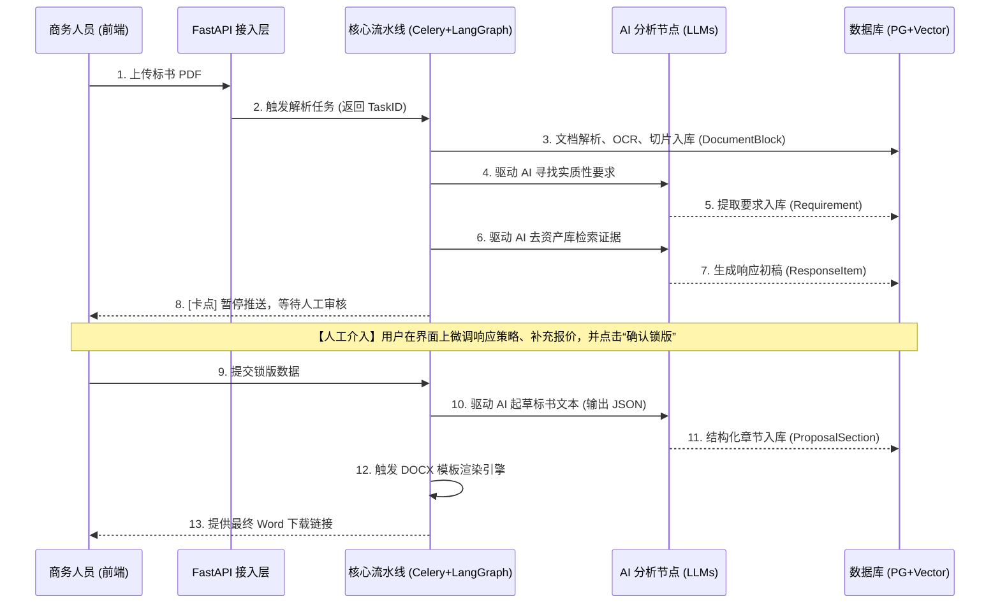

# 智能招投标系统 - V2.0 架构设计方案 (Architecture Design)

> **设计背景**：本方案基于第一版“多 Agent 协作” MVP 架构的深度评审与反思。V2.0 架构的核心理念从“由 AI 智能体自主决策与路由”转变为“**确定性流水线控制 + 大模型受控节点提取 + 人机协同最终决策**”。系统由“炫技型的 AI Demo”正式向“严肃、可追溯、结构化的企业级生产系统”迈进。

## 1. 核心设计哲学 (Design Philosophy)

在 V2.0 架构中，系统遵循以下基本原则：
1. **AI 负责草拟，程序负责校验，人工负责决策**：任何涉及成本、资质红线、版面最终生成的工作，严禁由大模型自主生成，必须通过代码规则引擎校验，并设立人工审核卡点。
2. **万物皆可溯源 (Traceability)**：系统中提取的每一条“要求 (Requirement)”，必须能精准定位到原 PDF 的物理页码、章节和原始文本块；生成的每一条“响应 (Response)”，必须关联到真实的“企业资产证据 (Evidence)”。
3. **状态持久化优先 (DB First)**：废弃臃肿的内存状态流转，LangGraph 的 `State` 只保留任务 ID 和游标状态，所有业务数据（文档块、要求、风险）第一时间落入 PostgreSQL 数据库。

---

## 2. 核心业务模型：要求响应矩阵与资产库

系统不再单纯围绕“风险、策略、成本”三个孤立的点进行分析，而是构建一套统一闭环的**“招标要求响应矩阵” (Requirement Response Matrix)**。

### 2.1 招标要求响应矩阵
这是贯穿整个招投标生命周期的核心数据结构：
*   **`Requirement` (要求项)**：AI 从标书中提取出的每一条实质性条件（如“需提供近3年业绩”、“需 ISO9001 证书”）。
*   **`ResponseItem` (响应项)**：针对特定要求的解答。包含是否满足（红黄绿灯）、AI 草拟的响应文案，以及关联的证据 ID。
*   **`ProposalSection` (标书章节)**：最终标书的组装块，将关联的 `ResponseItem` 组合成具体的章节内容（纯 JSON 数据，供后期 Word 渲染）。

### 2.2 企业资产库 (Enterprise Assets)
作为系统生成的唯一“真理”来源（RAG 数据库）。
*   **`Asset_Qualification` (资质库)**：营业执照、证书、软件著作权。
*   **`Asset_ProjectCase` (业绩库)**：历史中标合同、验收单（结构化存储了金额、甲方、时间）。
*   **`Asset_Employee` (人员库)**：项目经理、工程师的证书与履历。

---

## 3. 后端架构层级划分 (DDD 领域驱动设计)

彻底废弃传统的 `api/`, `services/`, `models/` 扁平结构，改为按业务领域（Domains）的高内聚结构，便于后期横向扩展。

```text
backend/app/
├── modules/                   # [★ 核心：业务领域层]
│   ├── projects/              # 项目主数据域 (创建、状态流转)
│   ├── documents/             # 文档处理域 (文件解析、OCR、切片、DocumentBlock 落库)
│   ├── requirements/          # 响应矩阵域 (要求提取、合规匹配、规则校验)
│   ├── enterprise_assets/     # 企业资产域 (资质、业绩库的 CRUD 与检索引擎)
│   └── proposal/              # 标书生成域 (JSON 结构化章节组装、DOCX 渲染输出)
│
├── workflows/                 # [★ 核心：确定性工作流层]
│   ├── tender_pipeline.py     # 主线 DAG：文件上传 -> 拆解 -> 要求提取 -> 人工审核 -> 生成
│   └── review_pipeline.py     # 审核流转机制
│
├── ai/                        # [★ AI 能力汇聚层：仅作为被调用的工具]
│   ├── llm_gateway.py         # 统一的大模型请求网关 (限流、重试、Token 计算)
│   ├── extractors.py          # 强制 JSON 结构化输出的分析节点 (如提炼 Requirement)
│   └── supervisor.py          # 悬浮助理 Agent (仅供辅助问答，无权干涉主流程)
│
├── infrastructure/            # [底层基础设施]
│   ├── database/              # PostgreSQL + pgvector 连接池与基类
│   ├── queue/                 # Celery 异步任务配置
│   └── storage/               # MinIO 对象存储交互
│
└── main.py                    # FastAPI 挂载点
```

---

## 4. 核心工作流设计 (The Deterministic Pipeline)

系统的核心不再是一个让大模型自由发挥的“多 Agent 自主网络”，而是一条**严格受控的确定性流水线 (DAG)**。大模型在这里扮演流水线上的“计件工人 (LLM Nodes)”。

### 4.1 标书生成主工作流



### 4.2 辅助问答助手 (慢车道 Supervisor)
*   **定位**：在前端右侧的侧边栏。
*   **能力**：它是一个真正的 Agent，可以调用检索工具（Tool Calling）查阅当前的标书原文或历史记录。
*   **限制**：它是**只读**的。它可以向用户解释“为什么这一条容易废标”，但它绝对不能直接修改数据库里的最终响应方案和报价。

---

## 5. 关键技术规范约定

1. **进度推送 (SSE 可靠传输)**
   废弃易丢消息的 Redis Pub/Sub。Agent 和 Pipeline 的中间状态通过 `Redis Streams` 或写入 PostgreSQL `job_events` 表持久化。前端断线重连时携带 `Last-Event-ID` 获取丢失事件。
2. **文档结构化留存 (DocumentBlock)**
   拆解阶段不仅要切取文本，必须保留格式语义（如 `is_bold`, `is_italic`），因为招投标中“加粗斜体字”往往代表实质性要求。
3. **去 LLM 排版化**
   大模型 (`Writer Agent`) 严禁直接输出 Markdown 或试图生成 Word 文件。大模型仅输出包含 `section_code`, `title`, `content_blocks` 的 **结构化 JSON**。最终的字体、字号、页眉页脚和红头，由传统的 Python `python-docx` 模板渲染器精准控制。
