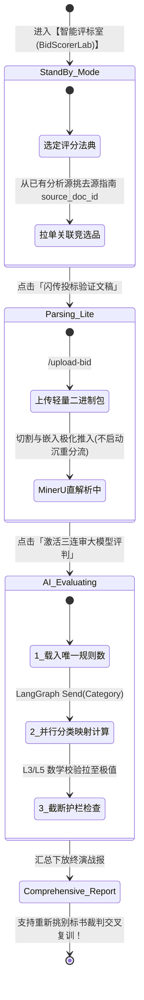

# 标书自动打分智能体 (BidScorerAgent) 前端设计方案

> **适用工程基本底色与目标栈**：React 19 + TypeScript + Vite + Tailwind CSS + Lucide React + Framer Motion + Recharts  
> **核心导向**：打造极度奢华与现代化（Vibrant Colors / Sleek Dark Mode / Glassmorphism）的高阶 SaaS 人机共融打分分析控制中心。

---

## 1. 核心视觉设计理念与高保真原型 (UI/UX Excellence)

为了创造 **“令人第一眼惊艳 (WOW-Factor)”** 的顶级沉浸式人机协作界面，我们在前端彻底扬弃枯燥生硬的白底数据表格与直硬表单，采纳以下视觉与交互规范：

- **极度严正的暗黑高档风格 (Sleek Dark Cyberpunk & Deep Slate Theme)**：  
  底托为沉实深暗色调（如 `bg-[#0B0F19]`、`bg-slate-950`），辅助大块毛玻璃磨砂（Glassmorphism）浮窗（`backdrop-blur-md bg-slate-900/60 border border-slate-800/80 shadow-2xl`）。
- **活力渐进撞色与智能体情绪呼应 (Curated HSL Color Palettes & Neomorphic Gradients)**：
  - **绿金畅行 (Emerald / Cyber Green - `#00F59B` & `#10B981`)**：展示高置信度打分（90+ 得分率、三轮标准差 0.0）和顺畅算术。
  - **赛博荧动电光银蓝 (Cyan & Sky Blue - `#00E5FF` & `#0EA5E9`)**：作为并发 Map-Reduce 进行中波浪态和多维展示指标主线。
  - **预警警戒黄赤交接 (Amber & Red Coral - `#F59E0B` / `#EF4444`)**：直连反映被系统 **L3/L5 防幻觉底线强制安全归中拉回** 及核心指标留白的警告说明书。
- **丰富的微小动感生命呼应 (Micro-Animations & Dynamic Interactions via Framer Motion)**：  
  无论鼠标略过明细展品行，还是全景图展开渲染，皆搭配有弹力的缓释拉扯与细碎缩动光晕过度渲染。

---

## 2. 工程模块布局与架构分解

前端在既有路由下构建为独立的专款分析引擎版图：

```
frontend/src/
├── api/
│   └── bidScorerApi.ts              # 面向 backend REST 规范的完全无缝 TS HTTP 调用包装
├── pages/
│   └── BidScorerLab/                # 【智能评估打分专列总控制场】
│       ├── index.tsx                # 主会场控制器 (含多量纲比考切页与全局用尺沙箱管理器)
│       ├── components/
│       │   ├── StandardSelector.tsx # 🌟 顶栏多源打分裁判指南分配挑选核心卡片
│       │   ├── UploadBidModal.tsx   # 快弹极速分批件极简进场穿梭机 (带微状态动图提示)
│       │   ├── ScoreOverviewHero.tsx # 中控中枢台: 霓虹总评分分环 & 三连击同策决议指标卡
│       │   ├── RadarMetricsChart.tsx # 多维类别合决能力雷达阵图 (基于 Recharts 引擎)
│       │   ├── GuardrailWarningBox.tsx # L5/L3 防幻觉越标阻挡即时通报 & TOP 3 抢分真义指路
│       │   └── ScoredItemDetailList.tsx # 穿透级一表横扫层展表件 (带 RAG 抓证底裤翻屏显示)
```

---

## 3. 分阶段交互设计实演 (Step-by-Step Interactive Workflow)



---

## 4. 核心挑战破解：如何在新页上驾驭多本不同的“招标文件”（不搞混规则）

结合对底层后端模型的深入对位，我们在界面头部特设一屏 **《评分法典分导站 (Source Standard Selector Hub)》**，向用户直达阐明当前是谁在审度谁：

### (1) 裁判池选择顶栏
* 左上悬浮超高辨识性控制选块，左挂 `lucide-react` 绿徽标志 `<Scale className="w-6 h-6 text-emerald-400" />`。
* 下拉菜单内呈现全部处于可抽取状态的过往立项真经字典（明确标注出：_"《2026 市级安防大显智融一期评分大表》 (含45项考核)"_）。
* 一且被选取，对应生成的 `source_doc_id` 死绑写入上下文沙箱锁；再投来的所有测试性应变底稿皆只由它全权统评计算，永无错连！

### (2) 一站多看：“时空跨标交叉决斗仪” 插件概念
* **破圈大招**：在前端支持把同一卷现做测试款标书（ `document_id` unchanged）通过右上勾搭框随意挑配换战不同标规库中的裁判卷！
* 主动展示：_“更换了农合商业金融准侧验读：预计我们同一组研发案得底分 86.2，比市级医院准测落回降层了 5.3，原因是未配齐全双密态认证协议！_”

---

## 5. 组件级 React & Tailwind & Recharts 代码指引实践

以下为真正打好即落到现场即可炫丽挥扫展现的 **组件样式架构示板**：

### 5.1 战况中心展示格：多目比降智能雷达战盘 `RadarMetricsChart.tsx`
利用依赖树已备选搭载的 `recharts` 作画，呈现科技感逼近的高清暗芒雷达打散分布：
```tsx
import React from 'react';
import { Radar, RadarChart, PolarGrid, PolarAngleAxis, PolarRadiusAxis, ResponsiveContainer, Tooltip } from 'recharts';

interface RadarProps {
  categoryScores: Record<string, { score: number; max_total: number; count: number }>;
}

export const RadarMetricsChart: React.FC<RadarProps> = ({ categoryScores }) => {
  // 构建供雷达读取的动态均数化透析点位数组
  const data = Object.entries(categoryScores).map(([catName, info]) => ({
    subject: catName,
    "最终实领能力度": Math.round((info.score / info.max_total) * 100),
    "极顶上限指标": 100,
    rawScore: info.score,
    maxPossible: info.max_total
  }));

  return (
    <div className="relative w-full h-80 bg-slate-900/70 border border-slate-800/80 rounded-2xl p-4 shadow-2xl backdrop-blur-xl flex flex-col justify-between overflow-hidden group hover:border-emerald-500/30 transition-all duration-500">
      <div className="flex items-center space-x-2">
        <span className="w-3 h-3 rounded-full bg-cyan-400 animate-ping" />
        <h3 className="text-sm font-semibold tracking-wider uppercase text-slate-300">维数共研·多品类平衡战绩雷达 (%), L1源自独享体系</h3>
      </div>
      
      <div className="w-full h-64">
        <ResponsiveContainer width="100%" height="100%">
          <RadarChart cx="50%" cy="50%" outerRadius="75%" data={data}>
            <PolarGrid stroke="#334155" strokeDasharray="3 3" />
            <PolarAngleAxis dataKey="subject" stroke="#94A3B8" tick={{ fill: '#E2E8F0', fontSize: 12, fontWeight: 500 }} />
            <PolarRadiusAxis angle={30} domain={[0, 100]} stroke="#475569" />
            <Tooltip 
              contentStyle={{ backgroundColor: '#0F172A', borderColor: '#1E293B', borderRadius: '8px', boxShadow: '0 10px 15px -3px rgba(0, 0, 0, 0.5)' }}
              formatter={(val: number, name: string, props: any) => [
                `${props.payload.rawScore} / ${props.payload.maxPossible} 分 (${val}%)`,
                '量化判定考核折兑度'
              ]}
            />
            <Radar
              name="AI均决战果"
              dataKey="最终实领能力度"
              stroke="#00E5FF"
              strokeWidth={2}
              fill="url(#emeraldGradient)"
              fillOpacity={0.65}
            />
            <defs>
              <linearGradient id="emeraldGradient" x1="0" y1="0" x2="0" y2="1">
                <stop offset="5%" stopColor="#00F59B" stopOpacity={0.8}/>
                <stop offset="95%" stopColor="#0EA5E9" stopOpacity={0.2}/>
              </linearGradient>
            </defs>
          </RadarChart>
        </ResponsiveContainer>
      </div>
    </div>
  );
};
```

### 5.2 核心突破展示区：智能建议锦囊与防线超阈自限指示灯 `GuardrailWarningBox.tsx`
结合后端护栏 L3 与 L5 极强的主导干涉保护，将警策和提升直指直露地以华美玻璃块堆在眼前：
```tsx
import React from 'react';
import { ShieldAlert, Zap, TrendingUp, Sparkles } from 'lucide-react';
import { motion } from 'framer-motion';

interface GuardrailProps {
  warnings: string[];
  improvements: string[];
}

export const GuardrailWarningBox: React.FC<GuardrailProps> = ({ warnings, improvements }) => {
  return (
    <div className="grid grid-cols-1 md:grid-cols-2 gap-6 mt-6">
      {/* 防幻觉数学校验阻隔拦截大显 */}
      <motion.div 
        initial={{ opacity: 0, x: -20 }}
        animate={{ opacity: 1, x: 0 }}
        className="bg-amber-950/20 border border-amber-500/30 rounded-2xl p-5 backdrop-blur-lg flex flex-col justify-between shadow-xl"
      >
        <div className="flex items-center space-x-3 pb-3 border-b border-amber-500/20">
          <div className="p-2 rounded-lg bg-amber-500/10 text-amber-400">
            <ShieldAlert className="w-5 h-5 animate-bounce" />
          </div>
          <h4 className="text-md font-bold text-amber-200 tracking-wide">防幻觉共识与L5数值顶盖审计拦获纪录</h4>
        </div>
        <div className="mt-3 space-y-2 flex-1 max-h-48 overflow-y-auto pr-2 custom-scrollbar">
          {warnings.length === 0 ? (
            <p className="text-sm text-slate-400 italic flex items-center gap-2 mt-4">
              <span className="w-2 h-2 rounded-full bg-emerald-400"></span> 终级查处没有任何夸张计算或强写分层，账款完全真实可证。
            </p>
          ) : (
            warnings.map((warn, idx) => (
              <div key={idx} className="flex items-start space-x-2 text-xs bg-slate-900/80 p-2.5 rounded-lg border border-slate-800 text-amber-300">
                <span className="font-mono text-amber-500 font-bold">[{idx+1}]</span>
                <span className="leading-relaxed">{warn}</span>
              </div>
            ))
          )}
        </div>
      </motion.div>

      {/* 大模型智脑提速抢高策略台 */}
      <motion.div 
        initial={{ opacity: 0, x: 20 }}
        animate={{ opacity: 1, x: 0 }}
        className="bg-gradient-to-br from-indigo-950/30 via-slate-900/70 to-emerald-950/20 border border-emerald-500/30 rounded-2xl p-5 backdrop-blur-lg shadow-xl"
      >
        <div className="flex items-center justify-between pb-3 border-b border-slate-800">
          <div className="flex items-center space-x-2">
            <Sparkles className="w-5 h-5 text-emerald-400" />
            <h4 className="text-md font-bold text-emerald-300 tracking-wide">高胜率抢牌 · Top-Priority 飞跃突围策略</h4>
          </div>
          <span className="text-xs px-2.5 py-0.5 rounded-full bg-emerald-500/10 text-emerald-300 border border-emerald-500/20 font-medium">
            实达涨注指路
          </span>
        </div>
        <div className="mt-3 space-y-3">
          {improvements.length === 0 ? (
            <p className="text-sm text-slate-400 italic mt-4">无强急迫的扣错指摘，整体应标卷已高度趋近饱和完善！</p>
          ) : (
            improvements.slice(0, 3).map((tip, idx) => (
              <div key={idx} className="group relative bg-slate-900/60 hover:bg-slate-800/80 transition-colors p-3 rounded-xl border border-slate-800/80 flex items-start space-x-3">
                <div className="w-6 h-6 rounded-md bg-emerald-500/20 text-emerald-400 flex items-center justify-center font-bold text-xs flex-shrink-0 mt-0.5 group-hover:scale-110 transition-transform">
                  #{idx+1}
                </div>
                <p className="text-sm text-slate-200 leading-snug font-normal">{tip}</p>
              </div>
            ))
          )}
        </div>
      </motion.div>
    </div>
  );
};
```

### 5.3  一揽深藏不漏底细翻查表：`ScoredItemDetailList.tsx`
让考核项支持手风琴自拉展开，重点渲染 **“置信度中位数指示器”** 还有由 **RAG 在后背精准抄来的实证依据**：
```tsx
import React, { useState } from 'react';
import { ChevronDown, ChevronUp, FileText, CheckCircle2, AlertCircle, Award } from 'lucide-react';
import { ScoreItem } from '../../api/bidScorerApi';

interface ListProps {
  items: ScoreItem[];
}

export const ScoredItemDetailList: React.FC<ListProps> = ({ items }) => {
  const [expandedId, setExpandedId] = useState<string | null>(null);

  return (
    <div className="mt-8 space-y-3">
      <div className="flex items-center justify-between pb-2 border-b border-slate-800/80">
        <h3 className="text-lg font-bold text-slate-200 flex items-center gap-2">
          <Award className="w-5 h-5 text-cyan-400" />
          系统合评实测条目矩阵明细一表一打穿
        </h3>
        <span className="text-xs text-slate-400 font-mono">
          共记考究品目: {items.length} 栏
        </span>
      </div>

      {items.map((item) => {
        const isExpanded = expandedId === item.id;
        const scoreRatio = (item.ai_score / item.max_score) * 100;
        const isFullScore = scoreRatio >= 99;

        return (
          <div 
            key={item.id} 
            className={`transition-all duration-300 rounded-xl border ${isExpanded ? 'bg-slate-900/90 border-cyan-500/40 shadow-xl shadow-cyan-500/5' : 'bg-slate-950/50 border-slate-800 hover:border-slate-700/80'}`}
          >
            {/* 顶排显性快扫排面 */}
            <div 
              onClick={() => setExpandedId(isExpanded ? null : item.id)}
              className="p-4 flex items-center justify-between cursor-pointer select-none"
            >
              <div className="flex items-center space-x-4">
                <span className="px-2.5 py-1 rounded-md bg-slate-800 text-cyan-300 font-mono text-xs font-semibold border border-slate-700">
                  {item.item_code || '通用单提'}
                </span>
                <div className="flex flex-col">
                  <span className="text-sm font-bold text-slate-100 group-hover:text-cyan-400 transition-colors">
                    {item.title}
                  </span>
                  <span className="text-xs text-slate-400 font-medium">
                    大目：{item.category} {item.sub_category ? ` / ${item.sub_category}` : ''}
                  </span>
                </div>
              </div>

              <div className="flex items-center space-x-6">
                {/* 3次评估共识水表微徽章 */}
                <div className="hidden md:flex flex-col items-end">
                  <div className="flex items-center space-x-1.5">
                    <div className={`w-2 h-2 rounded-full ${item.confidence > 0.85 ? 'bg-emerald-400 animate-pulse' : 'bg-amber-400'}`} />
                    <span className="text-xs font-mono font-medium text-slate-300">
                      三回合共识度: {Math.round(item.confidence * 100)}%
                    </span>
                  </div>
                  <span className="text-[10px] text-slate-500 font-mono">
                    样本记录: [{item.all_round_scores ? item.all_round_scores.join(', ') : '-'}]
                  </span>
                </div>

                {/* 实发战绩条块 */}
                <div className="w-28 text-right flex flex-col items-end">
                  <span className={`text-base font-black tracking-tight font-mono ${isFullScore ? 'text-emerald-400' : 'text-slate-100'}`}>
                    {item.ai_score} <span className="text-xs font-normal text-slate-500">/ {item.max_score}</span>
                  </span>
                  <div className="w-20 bg-slate-800 rounded-full h-1.5 mt-1 overflow-hidden">
                    <div 
                      className={`h-full rounded-full ${isFullScore ? 'bg-emerald-500' : scoreRatio > 60 ? 'bg-cyan-500' : 'bg-rose-500'}`} 
                      style={{ width: `${Math.min(100, Math.max(5, scoreRatio))}%` }}
                    />
                  </div>
                </div>

                <button className="text-slate-400 hover:text-white transition-colors">
                  {isExpanded ? <ChevronUp className="w-5 h-5" /> : <ChevronDown className="w-5 h-5" />}
                </button>
              </div>
            </div>

            {/* 开盖底部大阅看层 - RAG 全链取证 */}
            {isExpanded && (
              <div className="px-4 pb-5 pt-2 border-t border-slate-800/60 bg-slate-950/80 rounded-b-xl space-y-4 animate-fadeIn">
                <div className="grid grid-cols-1 md:grid-cols-3 gap-4">
                  
                  {/* RAG 命中原文依据 */}
                  <div className="md:col-span-2 bg-slate-900/90 border border-slate-800 p-3.5 rounded-lg space-y-1.5">
                    <span className="text-xs font-semibold text-emerald-400 flex items-center gap-1.5 uppercase tracking-wider">
                      <FileText className="w-4 h-4" />
                      RAG 语境快取锁定事实举证 (Ground Truth Evidence)
                    </span>
                    <p className="text-xs font-mono text-slate-300 leading-relaxed pl-5 border-l-2 border-emerald-500/50">
                      {item.scoring_basis || '【默认底线】暂未捕抓到显眼原句显发申证，执行守平计入规则。'}
                    </p>
                  </div>

                  {/* 扣分断代因由 & AI 补牢良方 */}
                  <div className="bg-slate-900/90 border border-slate-800 p-3.5 rounded-lg space-y-3 flex flex-col justify-between">
                    <div>
                      <span className="text-xs font-semibold text-rose-400 flex items-center gap-1.5 uppercase tracking-wider">
                        <AlertCircle className="w-4 h-4" />
                        主要折损原因归宗
                      </span>
                      <p className="text-xs text-slate-300 mt-1 pl-5 border-l-2 border-rose-500/40">
                        {item.deduction_reason ? item.deduction_reason : '一字未亏！全符规制！无失分。'}
                      </p>
                    </div>

                    {item.suggestion && (
                      <div className="pt-2 border-t border-slate-800/80">
                        <span className="text-[11px] text-cyan-300 font-bold block mb-1">
                          💡 定向填平建议
                        </span>
                        <p className="text-xs text-slate-300 font-normal leading-normal">
                          {item.suggestion}
                        </p>
                      </div>
                    )}
                  </div>

                </div>
              </div>
            )}
          </div>
        );
      })}
    </div>
  );
};
```
