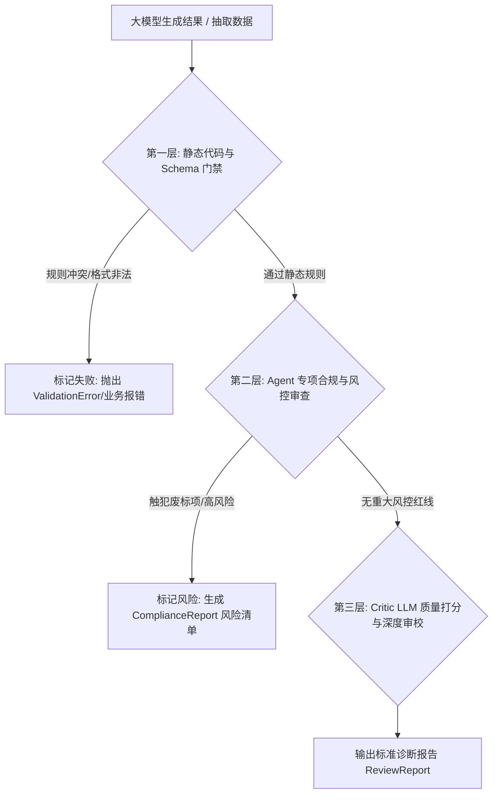

# 大模型与 Agent 审查与质检机制设计规范 (LLM Review & Audit Mechanism)

## 1. 概述与设计目标

在智能招投标系统（`bidding_sys`）中，大模型生成的输出（包括元数据抽取、资质评估、风控排查、标书偏离表以及技术方案文案）必须经过严格的**审查与质检机制（Review & Audit Mechanism）**。

### 1.1 审查机制与自纠错机制的区别与联系
* **审查机制 (Review & Audit)**：系统的“质检员”与“安全门禁”。负责独立**诊断、评估、打分以及发现合规/质量缺陷**，输出结构化的审查报告（如风险点列表、通过/不通过判定、分数）。
* **自纠错机制 (Self-Correction)**：系统的“自愈修复闭环”。负责接收审查机制给出的诊断报告与修改意见，回退到生成节点重新迭代修复。

```
+-----------------------------------------------------------------------+
|                             审查机制 (Review)                          |
|  [代码规则校验] ➔ [Agent 风控/合规审查] ➔ [Critic 质量打分] ➔ [产生诊断报告] |
+-----------------------------------┬-----------------------------------+
                                    │ 诊断报告 (Feedback & Score)
                                    ▼
+-----------------------------------------------------------------------+
|                            自纠错机制 (Self-Correction)                |
|           [检查重试次数] ➔ [拼装 Prompt 意见] ➔ [Actor 重新生成]          |
+-----------------------------------------------------------------------+
```

---

## 2. 审查机制的三大核心层次

系统中的审查机制分为三个互补的层次，从确定性的静态代码规则过渡到智能化的 AI 专家评审：



### 2.1 第一层：静态代码与 Schema 门禁 (Rule & Schema Inspector)
* **执行主体**：Python 确定性代码与 Pydantic 校验器。
* **审查内容**：
  1. **Schema 强校验**：字段数据类型、枚举值范围、必填项约束。
  2. **数学自洽性**：如标书各大类评分权重分值加和是否等于总分 100 分。
  3. **废话/主观字词拦截**：如售后服务条款中出现“态度好”、“质量优”等无物理数值边界的主观描述。

### 2.2 第二层：Agent 专项合规与风控审查 (Specialized Compliance & Risk Auditor)
* **执行主体**：专项风控 Agent (`strategy_risk`) 与合规审核节点 (`compliance_agent`)。
* **审查内容**：
  1. **废标项硬性审查**：扫描招标文件中的“*”号条款、资质强制阈值、财务指标红线。
  2. **法务条款暗坑排查**：识别违约金比例过高、付款条件严苛、不可抗力条款缺失等风险。
  3. **偏离表审查**：比对投标人资质与招标文件需求，判定是“无偏离”、“正偏离”还是“负偏离”。

### 2.3 第三层：Critic LLM 质量打分与深度审校 (LLM Critic & Scoring Rubric)
* **执行主体**：独立配置的 Critic / Evaluator LLM 节点。
* **审查内容**：
  1. **多维度量化打分**：从“内容完整性”、“技术应答契合度”、“专业严谨度”三个维度进行 0-100 百分制打分。
  2. **结构化诊断输出**：生成包含了通过状态（`is_passed`）、综合得分（`score`）、缺陷清单（`issues`）以及针对性修改建议（`actionable_feedbacks`）的标准报告。

---

### 2.4 四大业务审查维度总结与技术映射

在招投标业务视角下，审查机制具体分为以下 **4 个业务维度**，并分别映射到上述技术分层中执行：

| 业务审查维度 | 核心审查内容 | 映射技术分层 |
| :--- | :--- | :--- |
| **1. 结构与格式自洽性审查** | 字段 Schema 类型、零幻觉/不凭空编造、权重加和自洽 (100分)、拦截“假大空”主观虚词 | **第一层** (静态代码与 Schema 门禁) |
| **2. 合规性与废标红线审查** | 带 `*` 号星号条款响应、资质硬性门槛匹配、财务审计红线 | **第二层** (Agent 专项合规与风控审查) |
| **3. 法务与合同风险审查** | 违约金比例上限、付款条件与苛刻账期、知识产权与免责暗坑 | **第二层** (Agent 专项合规与风控审查) |
| **4. 投标文案与技术质量审查** | 方案针对性（避免套话）、章节覆盖完整度、偏离表准确性、0-100分量化打分 | **第三层** (Critic LLM 深度审校) |

---

## 3. 标准审查报告数据结构 (Review Standard Schema)

所有审查节点（不论是代码规则审查还是 Critic Agent 审查）必须统一返回符合以下标准的结构化报告模型：

```python
from typing import List, Optional
from pydantic import BaseModel, Field

class ReviewIssue(BaseModel):
    """单项审查发现的缺陷或风险点"""
    issue_type: str = Field(description="缺陷类型: 废标风险(fatal) / 负偏离(negative_deviation) / 内容缺失(missing) / 逻辑矛盾(logic_error)")
    severity: str = Field(description="严重程度: 高(high) / 中(medium) / 低(low)")
    location: Optional[str] = Field(None, description="问题定位 (如: 章节名或字段名)")
    description: str = Field(description="问题的具体描述")
    original_text: Optional[str] = Field(None, description="引发问题的原文片段")

class ReviewReport(BaseModel):
    """统一审查诊断报告"""
    is_passed: bool = Field(description="审查是否通过 (True=合格卡点放行, False=不合格拦截)")
    score: float = Field(description="综合质量评分 (0.0 ~ 100.0)")
    summary: str = Field(description="审查结论概述")
    issues: List[ReviewIssue] = Field(default_factory=list, description="发现的缺陷与风险点列表")
    actionable_feedbacks: List[str] = Field(
        default_factory=list, 
        description="给生成节点的具体修改指导意见 (若需要触发自纠错时使用)"
    )
```

---

## 4. 代码实现示范

### 4.1 静态规则审查器实现 (Rule Inspector)

```python
from loguru import logger
from app.docs.schemas import ReviewReport, ReviewIssue  # 假设导入

def inspect_evaluation_schema(data_dict: dict) -> ReviewReport:
    """静态代码审查器：检查评分细则元数据的合法性"""
    issues = []
    
    # 1. 检查权重分值总和
    weights = data_dict.get("weight_distribution", {})
    if weights:
        total = sum(weights.values())
        if abs(total - 100.0) > 0.01:
            issues.append(ReviewIssue(
                issue_type="logic_error",
                severity="high",
                location="weight_distribution",
                description=f"各大类权重分值加和为 {total}，不等于 100 分。"
            ))

    # 2. 检查硬性服务条款有效性
    service_reqs = data_dict.get("hard_service_requirements", {})
    for k, v in service_reqs.items():
        if isinstance(v, str) and ("好" in v or "满意" in v):
            issues.append(ReviewIssue(
                issue_type="missing",
                severity="medium",
                location=f"hard_service_requirements.{k}",
                description=f"条款 '{k}' 的描述 '{v}' 缺少明确的物理数值边界。"
            ))

    is_passed = len(issues) == 0
    score = 100.0 - (len(issues) * 15.0)
    score = max(0.0, score)

    feedbacks = [issue.description for issue in issues]

    return ReviewReport(
        is_passed=is_passed,
        score=score,
        summary="静态规则审查完成" if is_passed else f"审查发现 {len(issues)} 处规则瑕疵",
        issues=issues,
        actionable_feedbacks=feedbacks
    )
```

### 4.2 Critic Agent 智能审查节点实现 (`compliance_agent.py`)

```python
from app.services.llm_service import llm_service
from app.docs.schemas import ReviewReport
from loguru import logger

def run_compliance_audit(target_doc_text: str, requirement_text: str) -> ReviewReport:
    """Agent 专项合规审查器：比对投标文案与招标文件要求"""
    system_prompt = """
你是【资深招投标合规审计专家】。你的任务是对传入的投标响应文案进行严苛的合规性与废标风险审查。

【审查维度】：
1. **废标条款红线**：是否对招标文件中的星号(*)条款进行了响应，是否存在响应负偏离？
2. **资质与业绩真实性**：提供的资质证书与业绩案例是否完全覆盖招标要求？
3. **内容饱满度与专业度**：方案是否空洞套话连篇？

请严格按照 ReviewReport 模型输出结构化诊断报告。如果存在风险，必须在 actionable_feedbacks 中给出清晰明确的修改指令。
"""
    prompt = f"""
{system_prompt}

<招标文件硬性要求>
{requirement_text}
</招标文件硬性要求>

<待审查的投标响应草稿>
{target_doc_text}
</待审查的投标响应草稿>
"""
    logger.info("启动 Agent 专项合规审查流程...")
    
    report: ReviewReport = llm_service.generate_structured_output(
        prompt=prompt,
        schema_cls=ReviewReport,
        temperature=0.1  # 审查节点要求严谨，使用低 temperature
    )
    
    logger.info(f"审查完成: is_passed={report.is_passed}, 评分={report.score}, 风险项={len(report.issues)}")
    return report
```

---

## 5. 审查机制的两种使用形态

根据业务流程的不同需求，审查机制产生的 `ReviewReport` 可以通过以下两种形态工作：

### 5.1 形态 A：单向审查报告（仅呈现，不自动修补）
* **流程**：用户点击“合规排查” ➔ 运行 `run_compliance_audit()` ➔ 将 `ReviewReport` 风险点展示在前端 UI 仪表盘（如红色警示卡片）。
* **优点**：适用于需要人工二次决策、法律风险极高必须由人类律师签字的场景。

### 5.2 形态 B：闭环审查驱动自纠错（与自纠错机制结合）
* **流程**：`Writer Agent` 生成草稿 ➔ `Compliance Agent` 审查 ➔ 若 `ReviewReport.is_passed == False` ➔ 将 `ReviewReport.actionable_feedbacks` 传回 `Writer Agent` 触发自动改写。
* **优点**：实现全自动的“生成 - 质检 - 修复 - 再质检”无人化自愈闭环。

---

## 6. 维护历史 (Changelog)

* **2026-07-23**：初始版本发布，定义 `bidding_sys` 审查与质检机制设计规范，明确审查报告数据结构及与自纠错机制的协同关系。
