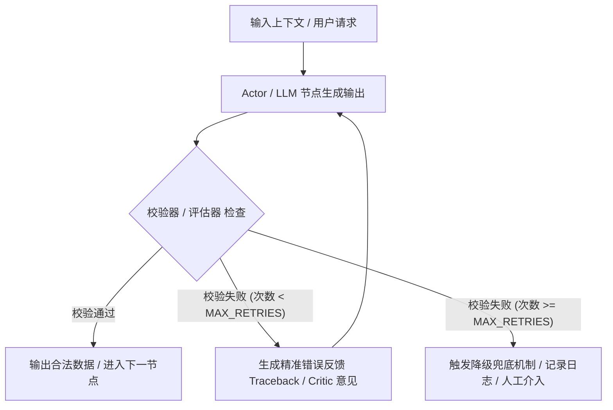

# 大模型与 Agent 自纠错机制设计规范 (LLM Self-Correction Mechanism)

## 1. 概述与设计目标

在基于大模型（LLM）与多 Agent 协作的系统（如智能招投标系统 `bidding_sys`）中，LLM 输出可能面临以下挑战：
1. **结构化格式崩溃**：如输出不合法的 JSON、缺失 Pydantic 必填字段或数据类型不匹配；
2. **业务逻辑矛盾**：如输出合法的 JSON，但各大类评分权重加和不等于 100 分、数据与原文上下文矛盾、或包含禁止的主观描述；
3. **文本生成质量瑕疵**：如标书章节撰写偏离招标文件要求、答复空洞或缺少硬性指标数值支撑。

为了提高大模型调用的**鲁棒性 (Robustness)**、**准确率 (Accuracy)** 和**自动化率 (Automation)**，系统引入**自纠错机制（Self-Correction / Self-Reflection Mechanism）**。本文档详细规定了自纠错机制的四大核心模式、实现规范及最佳实践。

> 💡 **相关文档**：关于如何独立诊断问题、进行风控审计与生成质量打分，请参见 companion 文档：[大模型与 Agent 审查与质检机制设计规范 (LLM Review & Audit Mechanism)](file:///d:/Myproject/bidding_sys/docs/LLM_REVIEW_AND_AUDIT_MECHANISM.md)。

---

## 2. 自纠错四大核心模式

架构上，自纠错机制分为四个层级，从底层的语法格式校验延伸至高层的 Agent 智能审校：



### 2.1 模式一：语法与 Schema 强校验自纠错 (Syntactic Auto-Fix Loop)
* **适用场景**：Pydantic 结构化数据抽取（如元数据解析 `EvaluationSchema`）、工具调用参数校验失败。
* **机制**：捕获 Pydantic `ValidationError` 或 `JSONDecodeError`，提取具体的异常 Traceback，将其作为 `Error Feedback` 拼接到下一个 Prompt 中，强制 LLM 针对错误字段进行二次修正。

### 2.2 模式二：业务逻辑与规则自纠错 (Rule & Business Logic Loop)
* **适用场景**：符合 JSON 格式但违反明确业务约束的场景（如评分大类分值加和不等于 100、质保期未提炼具体数值、或者包含模糊主观废话）。
* **机制**：在 Python 端编写校验器函数 (Validator Function)。若校验不通过，构造格式化的业务提示词（如 `"各大类权重加和为 90 分，不等于 100 分"`），送回 LLM 重新生成。

### 2.3 模式三：LangGraph 中的 Agent 反射/审查循环 (Evaluator-Optimizer / Critic Pattern)
* **适用场景**：标书起草 (Writer Agent)、方案撰写等复杂长文本的质量控制与合规审查。
* **机制**：在 LangGraph 状态图中设计 **生成节点 (Writer)** 与 **审查节点 (Critic/Evaluator)**：
  - Writer 节点负责生成初稿；
  - Critic 节点独立审查初稿并进行多维度打分；
  - 如果审查不通过，通过 conditional_edge 将修改意见反馈给 Writer 节点重写，直至达标或达到重试上限。

### 2.4 模式四：总控 Supervisor 级别的动态重试与容错 (Supervisor Retry Orchestration)
* **适用场景**：多 Agent 动态调度时，某个 Worker 执行中断或异常退出。
* **机制**：全局状态 `BiddingState` 维护 `retry_counts: Dict[str, int]`，Supervisor 实时监控各 Worker 的重试次数。若未超限，重新派发任务；若超限，跳过该 Worker 并进行系统降级通知。

---

### 2.5 自纠错模式与四大业务审查维度的映射关系

“审查”负责**诊断发现问题**，“自纠错”负责**闭环修复问题**。四种自纠错模式精确对应四大业务审查维度的修复动作：

| 业务审查维度 (发现的问题) | 对应的自纠错模式 (修复动作) | 纠错闭环如何运行 |
| :--- | :--- | :--- |
| **1. 结构与格式自洽性审查**<br>*(发现: JSON报错/加和不等于100/假大空虚词)* | **模式一 (Schema 强校验)**<br>**模式二 (规则自纠错 Loop)** | 捕获 Pydantic `ValidationError` 或 Python `ValueError`，将缺失字段、加和差值、虚词警告拼接入 Prompt 重新调用 LLM 提取。 |
| **2. 合规性与废标红线审查**<br>*(发现: 星号条款响应缺失/负偏离)* | **模式三 (Writer-Critic 循环)** | `compliance_agent` 生成缺漏红线清单，送回 `writer_agent` 补全星号条款响应或更正偏离说明。 |
| **3. 法务与合同风险审查**<br>*(发现: 违约金陷阱/账期苛刻)* | **模式三 (Writer-Critic 循环)** | `strategy_risk` 生成法务风险提示词，送回 `writer_agent` 在偏离表或澄清文件中增加防范性补充声明。 |
| **4. 投标文案与技术质量审查**<br>*(发现: 打分低于80/方案空洞/漏章节)* | **模式三 (Writer-Critic 循环)**<br>**模式四 (Supervisor 调度重试)** | Critic 节点生成具体的改进意见 (`actionable_feedbacks`)，通过 LangGraph 条件边驱动 Writer 重新撰写打磨初稿。 |

---

## 3. 代码实现规范与示范

### 3.1 结构化抽取自纠错实现 (`BaseMetadataService`)

在元数据抽取服务基类中封装通用自纠错抽取逻辑：

```python
import json
from typing import Type, TypeVar, Any, Optional
from pydantic import BaseModel, ValidationError
from loguru import logger
from app.services.llm_service import llm_service

T = TypeVar("T", bound=BaseModel)

class BaseMetadataService:
    def extract_with_self_correction(
        self, 
        context: str, 
        schema_cls: Type[T], 
        system_prompt: str, 
        document_id: str,
        max_retries: int = 2
    ) -> T:
        """带自纠错与反馈重试的结构化元数据抽取服务。

        :param context: 待抽取的标书原文片段
        :param schema_cls: 目标 Pydantic Schema 类型
        :param system_prompt: 系统提示词
        :param document_id: 关联文档 ID
        :param max_retries: 最大纠错重试次数（默认 2 次）
        :return: 实例化并校验通过的 Pydantic 对象
        """
        base_prompt = f"""
{system_prompt}

【任务约束】
1. 必须严格按照指定 Schema 格式抽取信息。
2. 宁缺毋滥原则：原文未提及的字段必须设为 null，严禁主观推断或编造。

<文本上下文>
{context}
</文本上下文>
"""
        error_feedback = ""

        for attempt in range(1, max_retries + 2):
            # 动态拼接上一轮的纠错反馈
            current_prompt = base_prompt
            if error_feedback:
                current_prompt += f"\n\n⚠️ 【上一轮生成失败反馈，请针对性修正】：\n{error_feedback}"

            logger.info(f"[Self-Correction] 执行元数据抽取: {schema_cls.__name__} (第 {attempt}/{max_retries + 1} 次尝试)")

            try:
                # 1. 调用 LLM 进行结构化提取
                result_obj = llm_service.generate_structured_output(
                    prompt=current_prompt,
                    schema_cls=schema_cls,
                    temperature=0.1
                )

                # 2. 执行自定义业务逻辑校验
                validation_err = self._validate_business_rules(result_obj)
                if validation_err:
                    raise ValueError(validation_err)

                # 校验通过
                logger.success(f"✅ 元数据解析并成功通过自纠错校验: {schema_cls.__name__}")
                return result_obj

            except (ValidationError, ValueError, Exception) as e:
                error_msg = str(e)
                logger.warning(f"⚠️ 第 {attempt} 次抽取/校验失败: {error_msg}")

                if attempt > max_retries:
                    logger.error(f"❌ 达到最大纠错重试上限 ({max_retries} 次)，引发异常降级")
                    raise e

                # 构造明确的错误反馈文本
                error_feedback = f"错误类型: {type(e).__name__}\n详细报错: {error_msg}\n请检查返回字段格式与业务约束后重新生成。"

    def _validate_business_rules(self, pydantic_obj: BaseModel) -> Optional[str]:
        """业务逻辑校验钩子函数，子类可重写此方法注入特定业务规则"""
        return None
```

---

### 3.2 业务规则校验器实现示例 (`EvaluationService`)

针对标书评分细则解析，重写业务校验逻辑：

```python
from app.services.metadata.base import BaseMetadataService
from app.services.metadata.evaluation_service import EvaluationSchema

class EvaluationService(BaseMetadataService):
    def _validate_business_rules(self, pydantic_obj: EvaluationSchema) -> Optional[str]:
        """校验评分表逻辑自洽性"""
        # 1. 大类权重加和校验
        if pydantic_obj.weight_distribution:
            total_weight = sum(pydantic_obj.weight_distribution.values())
            if total_weight > 0 and abs(total_weight - pydantic_obj.total_score) > 0.01:
                return (
                    f"权重分布 weight_distribution 的分值总和为 {total_weight}，"
                    f"与总分 total_score ({pydantic_obj.total_score}) 不一致，请重新核算。"
                )
        
        # 2. 硬性售后条款防止主观描述
        if pydantic_obj.hard_service_requirements:
            for key, val in pydantic_obj.hard_service_requirements.items():
                if isinstance(val, str) and ("好" in val or "优秀" in val or "满意" in val):
                    return f"售后要求字段 '{key}' 的内容 '{val}' 属于主观描述，必须提取带具体数值边界的硬性条款（如响应时间、质保年限），若无请设为 null。"
        
        return None
```

---

### 3.3 LangGraph Writer-Critic 审校循环实现

在 LangGraph 多 Agent 图流程中构建智能审校与重写节点：

```python
from typing import Literal, Dict, Any
from pydantic import BaseModel, Field
from app.agents.state import BiddingState
from app.services.llm_service import llm_service
from loguru import logger

class QualityEvaluation(BaseModel):
    is_passed: bool = Field(description="方案质量是否达到投标标准")
    score: float = Field(description="综合质量评分 (0-100)")
    critic_comments: str = Field(description="具体审查意见或需要重写的缺失点")

# 1. 撰写节点 (Writer Node)
def writer_executor_node(state: BiddingState) -> Dict[str, Any]:
    task = state.get("chapter_tasks", [{}])[0]
    feedback = state.get("critic_feedback", "")
    retry_count = state.get("writer_retry_count", 0)

    prompt = f"请撰写投标章节：{task.get('title')}\n撰写要求：{task.get('requirements')}"
    if feedback:
        prompt += f"\n\n【审校专家修改意见，请务必针对性重写修正】：\n{feedback}"

    content = llm_service.generate_text(prompt=prompt, temperature=0.7)
    return {
        "current_draft": content,
        "writer_retry_count": retry_count + 1
    }

# 2. 审校节点 (Critic Node)
def critic_evaluator_node(state: BiddingState) -> Dict[str, Any]:
    draft = state.get("current_draft", "")
    eval_prompt = f"你是资深评标专家，请严格审核以下投标文案草稿：\n\n{draft}"
    
    eval_res: QualityEvaluation = llm_service.generate_structured_output(
        prompt=eval_prompt,
        schema_cls=QualityEvaluation
    )
    
    logger.info(f"[Critic] 方案审校完成: passed={eval_res.is_passed}, score={eval_res.score}")
    return {
        "is_passed": eval_res.is_passed,
        "critic_feedback": eval_res.critic_comments
    }

# 3. 条件边判断函数 (Conditional Edge)
def route_after_critic(state: BiddingState) -> Literal["writer_executor_node", "save_output_node"]:
    is_passed = state.get("is_passed", False)
    retry_count = state.get("writer_retry_count", 0)
    
    # 通过审查 或 达到最大自纠错次数（2次），退出循环
    if is_passed or retry_count >= 2:
        if not is_passed:
            logger.warning(f"⚠️ 文案审校未达标，但已达到最大纠错次数 ({retry_count})，强制降级输出")
        return "save_output_node"

    logger.info(f"🔄 审校未通过，触发 Writer 自纠错重新生成 (当前已尝试 {retry_count} 次)")
    return "writer_executor_node"
```

---

## 4. 自纠错设计黄金法则与防坑指南

1. **严格限制最大重试次数 (`MAX_RETRIES`)**
   - **规则**：所有纠错循环必须显式指定重试上限（建议为 `2~3` 次）。
   - **原因**：防止 LLM 陷入无限死循环，导致系统响应卡死和 Token 费用暴涨。

2. **精准无误的错误反馈 (Precise & Actionable Error Feedback)**
   - **规则**：切勿使用通用废话（如 `"重新生成"` 或 `"生成失败"`）。
   - **原因**：LLM 无法从泛泛的警告中提取修复要点。反馈必须包含：① 错误字段名；② 导致错误的具体数值或文本；③ 正确格式的样例。

3. **保留 CoT 思维链推导 (Chain-of-Thought)**
   - **规则**：在 Pydantic Schema 中保留 `reasoning: Optional[str]` 字段。
   - **原因**：让大模型在输出结果前先进行“自我检查”与“思考推导”，可将第一次生成的正确率提升 30% 以上。

4. **优雅降级与防御性编程 (Graceful Fallback)**
   - **规则**：当重试次数达到上限仍未通过时，系统不得抛出未捕获崩溃异常。
   - **措施**：填充合理的默认值、记录包含完整的 Traceback 的 `logger.error()`，并在 UI 侧向用户提示“该模块已生成初步结果，建议人工核对”。

5. **全流程结构化日志追踪 (Structured Logging)**
   - **规则**：必须统一使用 `loguru.logger` 记录每次纠错的原因、轮数与反馈文本，支持追溯每一个自纠错事件。

---

## 5. Changelog / 维护历史

* **2026-07-23**：初始版本发布，定义 `bidding_sys` 大模型与 Agent 自纠错机制标准规范及示范代码。
