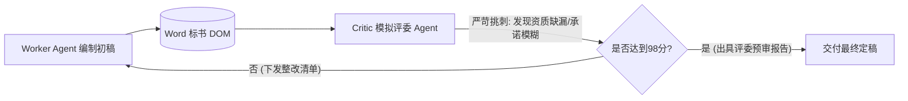

# 标书填报智能体（Bid Filler Agent）高阶智能化演进方案蓝图

## 一、 演进愿景与核心目标

当前标书填报系统已具备高精度的 DOM 原位切片、去硬编码提示词驱动、全形态槽位识别（下划线/括号/纯空格）以及全行业四维专家分工体系（造价、资质、偏离、公文）。

为了让 Agent 从 **“精准执行型工具（Precision Executor）”** 跃升为 **“顶级标书总监级智能体（Strategic Bidding Co-pilot）”**，本方案规划了五大前沿智能化升级维度，全面提升标书编制的**中标率、合规度、排版美学与企业知识沉淀能力**。

---

## 二、 五大高阶智能化方案深度设计

```
                       ┌──────────────────────────────────────────────┐
                       │   Level 5: 战略级标书专家 Agent (未来演进)    │
                       └──────────────────────┬───────────────────────┘
                                              │
         ┌───────────────────┬────────────────┼───────────────────┬───────────────────┐
         ▼                   ▼                ▼                   ▼                   ▼
 1. 评分点最大化博弈   2. 全卷一致性对账   3. 模拟专家对抗质检   4. 经验自学习记忆   5. 排版审美与证照增强
 (争取技术最高分)    (跨章节数字零冲突)   (评委视角严苛挑刺)   (越用越懂企业偏好)  (透视矫正/动态水印)
```

---

### 方案一：博弈与策略智能（从被动合规到主动争取最高分）

#### 1. 评标办法评分点最大化挖掘（Scoring Maximization）
- **核心逻辑**：
  在填写《技术要求响应及偏离表》或方案章节前，Agent 自动对《第三章 评标办法》中的评分细则进行深度结构化解析；
- **智能行为**：
  - 若评标细则规定“技术参数优于招标文件要求的，每项加 1 分”，Agent 自动检索企业产品库中性能更优的规格（例如招标要求效率 $\ge 22.5\%$，企业实测为 $22.8\%$）；
  - 主动在第 4 列申报为“正偏离”，并在第 3 列详述技术优势与实验检测报告编号，主动为技术标争取最高分。

#### 2. 废标红线探照灯（Disqualification Pre-check Radar）
- **核心逻辑**：
  前置构建“一票否决合规雷达”，全量提炼招标文件中带有 `★`、`#`、`必须`、`否则按无效投标处理` 的强约束条款；
- **智能行为**：
  作为 Worker Agent 的最高优先级前置约束，并在提交前进行专门的“废标项逐条对齐核验”，彻底杜绝因人为或模型疏漏造成的废标风险。

---

### 方案二：全卷跨章节数据与实体“零冲突对账”（全局一致性守护神）

#### 1. 跨章节财务三表闭环校验（Financial Coherence Check）
- **核心逻辑**：
  建立全卷动态数据账本，实施跨章节自动对账：
  $$\text{《投标函》总报价} \equiv \text{《开标一览表》投标总价} \equiv \sum \text{《分项清单》各分项合价} \equiv \sum \text{耗材与服务费}$$
- **智能行为**：
  一旦发现大模型在计算或提取时产生 1 分钱的四舍五入偏差或大小写金额不一致，系统级拦截并自动校准，确保全卷数字严丝合缝。

#### 2. 人员与法人实体一致性校验（Entity Consistency Sentinel）
- **核心逻辑**：
  自动比对《投标函》签字代表、《法定代表人授权书》被授权人、《项目管理机构表》项目经理、《社保证明》缴纳人姓名、身份证号、执业资格证书编号是否完全一致，杜绝张冠李戴的低级失误。

---

### 方案三：引入“模拟评标专家”对抗式自审（Adversarial Critic & Reflection）



#### 1. 红蓝对抗与严苛挑刺机制
- **角色定位**：
  设立独立的 `Critic Agent`（模拟资深评标专家），以挑剔、防作弊、合规审查的严苛视角对已生成的标书进行全卷扫描；
- **挑刺维度**：
  1. 承诺是否过于空泛（如仅写“完全响应”，未列出具体数据指标与检测证明）；
  2. 证明材料是否与条款精准对应；
  3. 响应是否存在潜在歧义。

#### 2. 闭环自愈修复（Self-Healing Loop）
- Critic Agent 形成标准修复意见（Repair Instructions），自动下发给对应章节 Worker 进行第二轮定向润色与自愈重写，直到满足质量评分阈值后方可交付。

---

### 方案四：企业经验自演进与长效记忆（Self-Learning Long-Term Memory）

#### 1. 人机协同偏好记忆（Human-in-the-Loop Memory）
- **场景**：
  当用户工程师在前端对 Agent 生成的某段承诺或技术说明进行人工润色修正时；
- **智能行为**：
  系统自动提取该次修改的语义偏好与表达风格，将其沉淀至该企业的专属长效向量知识库中。下次遇到类似章节时，自动优先采用该企业的偏好表述。

#### 2. 标杆成功标书知识迁移
- 自动分析该企业历史中标的高分标书（如国家电网、政府集采等不同业主），提取最受该类采购人青睐的公文语调与技术排版模式，实现标书编制经验的自增量积累。

---

### 方案五：排版美学与智能证照处理（Visual & Document Aesthetics）

#### 1. 智能避免签名盖章栏断页（Smart Page-Break Optimization）
- **核心逻辑**：
  动态计算公文段落高度与页面空间，若检测到《法定代表人授权委托书》或《投标函》的签名盖章区仅剩两行被孤立挤到下一页；
- **智能行为**：
  Agent 自动微调上文行距或段落间距，确保签字盖章区完整、美观地收纳在同一页面内。

#### 2. 资质证照智能透视矫正与动态防伪水印
- **核心逻辑**：
  调取企业上传的营业执照、资质许可证等照片时，自动执行图像边缘检测、透视矫正与背景阴影消除；
- **智能行为**：
  自动在证书图片上渲染半透明倾斜防伪水印（例如：`"仅供 XXX 项目投标使用，复印无效"`），兼具合规安全性与高端视觉质感。

---

## 三、 分阶段实施落地建议（Roadmap）

| 阶段 | 重点实施任务 | 预期业务收益 |
| :--- | :--- | :--- |
| **Phase 1 (快速见效)** | • 跨章节财务三表数据闭环校验<br>• 全局废标红线探照灯规则注入 | 彻底杜绝前后数据冲突与废标风险 |
| **Phase 2 (质量飞跃)** | • 评标办法正偏离主动挖掘与加分优化<br>• Critic 模拟评标专家对抗自审机制 | 显著提升技术标与商务标的中标评分 |
| **Phase 3 (长期护城河)** | • 人机修改长效记忆与企业知识自演进<br>• 证照透视校正与公文防断页排版美化 | 打造极致用户体验与企业专属知识壁垒 |
