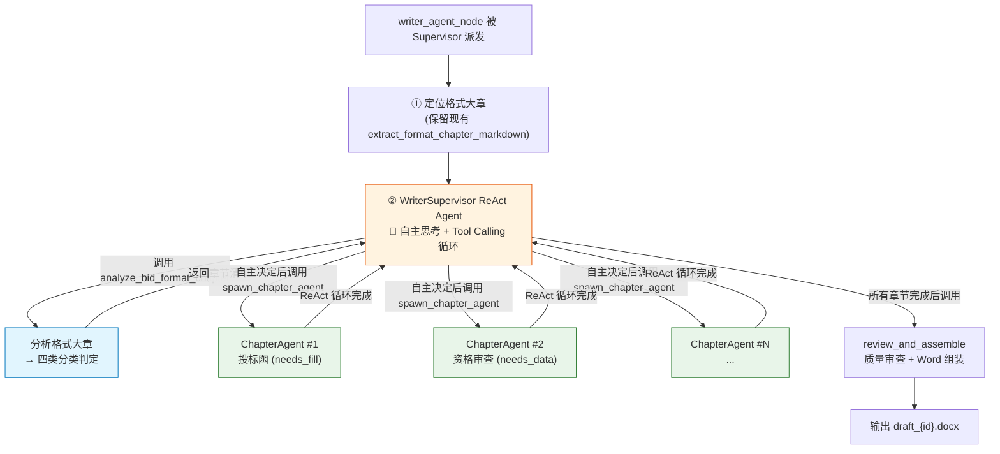

# WriterAgent 重设计：自主子 Agent 架构

> 📅 记录日期：2026-07-23
> 📌 状态：方案已确认，待实施

## 目标

将现有 WriterAgent 从「if-else 规则引擎 + asyncio.gather」重构为**「WriterSupervisor ReAct Agent 自主调度 + 动态创建 N 个 ChapterAgent」**架构。

### 已确认的设计决策

| 决策项 | 结论 |
|--------|------|
| Token 成本 | ✅ 可接受，不需要对简单章节走轻量路径 |
| 技术方案撰写 | ❌ 暂不让 Agent 撰写，标记 `[待人工补充]` 占位 |
| 子 Agent 代码量 | 不需要为每个子 Agent 写独立代码，一个工厂函数 + 工具注册表 |
| 并发策略 | 串行派发（ReAct 自然串行），后续可优化为批量 |

---

## 架构总览



---

## 核心机制：四类章节分类判定

Agent 区分「要填 / 不要填」不靠 if-else，靠 Prompt 中的 4 条判定规则让 LLM 自主分类：

| 分类 | 判定标准 | Agent 行为 | 示例 |
|------|---------|-----------|------|
| `needs_fill` | 原文有 `____`、下划线、占位符；固定格式文书 | 派发子 Agent → 保持原文格式精准填空 | 投标函、授权书、承诺函 |
| `needs_data` | 原文有空白表格或材料清单 | 派发子 Agent → 查 DB 装配数据 | 开标一览表、报价表、资格审查、人员表 |
| `needs_writing` | 甲方只给标题和简要要求，无模版 | **不派发子 Agent** → 标记 `[待人工补充]` | 技术方案、售后服务、施工组织 |
| `skip` | 注意事项、提示、说明、装订要求 | 直接跳过 | "注：以上材料需加盖公章" |

> **注意**：`needs_writing` 类型暂不进行 AI 撰写。后续可接入「公司内部方案知识库」后再开放。

### 分类判定 Prompt 规则

```
判定规则：
1. needs_fill：原文出现 "____"、下划线、"XXX"、"（ ）" 等占位符，
   或属于固定格式文书（投标函、授权书），有"致：""兹授权"等语句
2. needs_data：原文给出了空白表格框架（如"开标一览表"有表头无数据），
   或列出了需要提供的材料/证照清单
3. needs_writing：甲方只给了章节标题 + 简要说明/要求，无模版无表格
4. skip：是甲方对投标人的注意事项、提示、说明，如"注：""以上材料均需..."
```

---

## 变更文件清单

### WriterSupervisor 工具集

#### [NEW] `app/agents/tools/writer_supervisor_tools.py`

3 个工具，赋予 WriterSupervisor 自主决策能力：

**工具 1：`analyze_bid_format_chapter`** — 分析格式大章，输出四类分类结果

- 输入：`document_id` + `format_chapter_text`
- 内部：调用 `llm_service.generate_structured_output` 提取章节清单
- 输出 Schema：

```python
class ChapterClassification(BaseModel):
    """单章节分类结果"""
    chapter_number: str           # "一"
    chapter_title: str            # "一、投标函"
    category: Literal[            # 四类判定
        "needs_fill",             # 有下划线/占位符的模版
        "needs_data",             # 有空白表格/材料清单
        "needs_writing",          # 只有标题和要求
        "skip"                    # 说明/提示/注释
    ]
    category_reason: str          # 判定依据 (一句话)
    mapping_hint: str             # 数据映射标签 (bid_letter / qualification / pricing ...)
    template_text: Optional[str]  # 原文中该章节的模版段落 (needs_fill 类型必填)
    content_hint: Optional[str]   # 甲方填写说明

class FormatAnalysisResult(BaseModel):
    """格式大章分析结果"""
    total_chapters: int
    chapters: List[ChapterClassification]
```

**工具 2：`spawn_chapter_agent`** — 派发子 Agent

- 输入：`document_id`, `chapter_title`, `chapter_number`, `mapping_hint`, `category`, `template_text`, `content_hint`
- 内部：调用 `chapter_react_agent.run_chapter_agent()` 工厂函数
- `needs_writing` 类别直接返回占位符，不创建 ReAct Agent
- 输出：子 Agent 执行结果 JSON

**工具 3：`review_and_assemble`** — 质量审查 + Word 组装

- 输入：`document_id`
- 内部：
  1. 收集所有已完成的 chapter_results
  2. 调用现有的 `WordGenerator` 或 `clone_format_section_from_original_docx` 组装 Word
  3. 落盘到 `uploads/drafts/`
- 输出：草稿文件路径 + 质量摘要

---

### 子 Agent 工具集

#### [NEW] `app/agents/tools/chapter_agent_tools.py`

6 个共享工具，所有子 Agent 按 `mapping_hint` 动态分配：

| 工具 | 功能 | 分配给 |
|------|------|--------|
| `search_chapter_requirements` | RAG 检索该章节的招标原文要求 | 所有子 Agent |
| `query_metadata` | 查询 5 大元数据 (timeline/financial/...) | 所有子 Agent |
| `query_company_qualifications` | 查询资质中心 DB | qualification / personnel |
| `query_cost_estimation` | 查询成本分析结果 | pricing / cost |
| `query_strategy_analysis` | 查询策略分析结果 (资质评估/风险) | deviation / risk |
| `write_chapter_content` | 提交章节最终内容 | 所有子 Agent (必须调用) |

工具注册表：

```python
TOOL_REGISTRY = {
    "bid_letter":     [search_chapter_requirements, query_metadata, write_chapter_content],
    "authorization":  [search_chapter_requirements, query_metadata, write_chapter_content],
    "qualification":  [search_chapter_requirements, query_metadata, query_company_qualifications, write_chapter_content],
    "pricing":        [search_chapter_requirements, query_metadata, query_cost_estimation, write_chapter_content],
    "cost":           [search_chapter_requirements, query_metadata, query_cost_estimation, write_chapter_content],
    "deviation":      [search_chapter_requirements, query_strategy_analysis, write_chapter_content],
    "risk":           [search_chapter_requirements, query_strategy_analysis, write_chapter_content],
    "service":        [search_chapter_requirements, query_metadata, write_chapter_content],
    "personnel":      [search_chapter_requirements, query_company_qualifications, query_metadata, write_chapter_content],
    "performance":    [search_chapter_requirements, query_metadata, write_chapter_content],
    "financial":      [search_chapter_requirements, query_metadata, write_chapter_content],
    "schedule":       [search_chapter_requirements, query_metadata, write_chapter_content],
    "safety":         [search_chapter_requirements, query_metadata, write_chapter_content],
    "_unknown":       [search_chapter_requirements, query_metadata, write_chapter_content],
}
```

---

### 子 Agent 工厂

#### [NEW] `app/agents/nodes/chapter_react_agent.py`

**一个文件，一个工厂函数**，动态创建任意章节的 ReAct Agent：

**`build_chapter_agent_prompt()`** — 按参数动态生成 Prompt，核心结构：

```
角色：你是专精于【{chapter_title}】的招投标文书专家
任务：根据 category 不同执行不同策略
  - needs_fill：保持原文格式，精准替换占位符
  - needs_data：查询 DB/分析结果，组装完整表格
工作流：
  1. 先调 search_chapter_requirements 查甲方要求
  2. 按需调数据查询工具
  3. 生成内容
  4. 必须调 write_chapter_content 提交成果
Self-Correction：
  - 查询数据为空 → 换关键词重试 (最多 2 次)
  - 数据确实不存在 → 标注 [待补充]，接受现实
  - 严禁编造数据
```

**`run_chapter_agent()`** — 工厂函数，核心逻辑：

```python
def run_chapter_agent(document_id, chapter_title, mapping_hint, category, ...) -> Dict:
    # 1. needs_writing 直接返回占位符，不创建 Agent
    if category == "needs_writing":
        return {"filled_content": f"[待人工补充：{chapter_title}]", ...}
    
    # 2. 按 mapping_hint 从 TOOL_REGISTRY 选工具
    tools = TOOL_REGISTRY.get(mapping_hint, TOOL_REGISTRY["_unknown"])
    
    # 3. 构建专属 Prompt
    prompt = build_chapter_agent_prompt(chapter_title, mapping_hint, category, ...)
    
    # 4. 创建 ReAct Agent (与 Master Agent 同构)
    agent = create_react_agent(llm_service.raw_llm, tools)
    
    # 5. 执行 (Agent 自主 Think → Tool Call → Observe 循环)
    result = agent.invoke({"messages": [HumanMessage(content=prompt)]})
    
    return {...}
```

---

### 入口节点重构

#### [MODIFY] `app/agents/nodes/writer_agent_node.py`

**改动要点**：将中间的 Planner + asyncio.gather + Executor 替换为 WriterSupervisor ReAct Agent。

保留不动的部分：
- `extract_format_chapter_markdown()` — 格式大章定位逻辑
- 元数据读取逻辑
- Word 生成 + 落盘逻辑

替换的部分：

```python
# 原来：
#   chapter_tasks = plan_chapter_tasks_from_markdown(format_chapter_text)
#   chapter_results = _run_async_safely(execute_all_chapter_tasks(...))
#   outline_obj = llm_service.generate_structured_output(...)

# 替换为：
from langgraph.prebuilt import create_react_agent
from langchain_core.messages import HumanMessage
from app.agents.tools.writer_supervisor_tools import WRITER_SUPERVISOR_TOOLS

supervisor_agent = create_react_agent(llm_service.raw_llm, WRITER_SUPERVISOR_TOOLS)

prompt = f"""
你是投标书编制总控 Agent (WriterSupervisor)。

【投标文件格式大章原文】:
{format_chapter_text}

【你的任务】
1. 先调用 analyze_bid_format_chapter 工具，分析格式大章中有哪些章节、每个章节属于哪种类型
2. 审阅分析结果，自主决定哪些章节需要派发子 Agent、哪些跳过
3. 对每个需要处理的章节，调用 spawn_chapter_agent 工具派发子 Agent
4. 所有必要章节完成后，调用 review_and_assemble 工具进行文档组装

【决策原则】
- needs_fill 和 needs_data 类型：必须派发子 Agent
- needs_writing 类型：标记为待人工补充，不需要派发子 Agent
- skip 类型：直接忽略
- 总计子 Agent 不超过 15 个

【刹车机制】
- 每个子 Agent 如果返回失败，最多重试 1 次
- 完成所有 needs_fill + needs_data 章节后即可调用 review_and_assemble
"""

result = supervisor_agent.invoke({"messages": [HumanMessage(content=prompt)]})
```

---

### 旧文件处理

#### [保留] `app/agents/nodes/writer_executor_node.py`

过渡期保留，作为降级兜底（当 WriterSupervisor 执行异常时 fallback）。后续稳定后可删除。

---

## WriterSupervisor 完整执行示例

```
WriterSupervisor ReAct 循环:

🤔 Think: 我需要先分析格式大章，了解有哪些章节需要处理。

🔧 Act: analyze_bid_format_chapter(document_id, format_chapter_text)
📎 Observe: 
  分析完成，共识别 11 个章节:
  ✅ needs_fill: 投标函、授权书、承诺函 (3个)
  ✅ needs_data: 开标一览表、分项报价表、资格审查、人员表 (4个)
  ⏸️ needs_writing: 技术方案、售后服务、安全方案 (3个) → 标记占位
  ⏭️ skip: 装订说明 (1个)

🤔 Think: 需要派发 7 个子 Agent (3 needs_fill + 4 needs_data)。
        先处理投标函。

🔧 Act: spawn_chapter_agent("一、投标函", "bid_letter", "needs_fill", template="致：____...")
📎 Observe: 子 Agent 完成！查询了项目元数据，精准填空了投标函模版。✅

🔧 Act: spawn_chapter_agent("二、授权书", "authorization", "needs_fill", template="兹授权____...")
📎 Observe: 子 Agent 完成！✅

🔧 Act: spawn_chapter_agent("三、开标一览表", "pricing", "needs_data")
📎 Observe: 子 Agent 完成！查询了成本分析数据，组装了报价表格。✅

🔧 Act: spawn_chapter_agent("四、资格审查", "qualification", "needs_data")
📎 Observe: 子 Agent 完成！查询了资质中心 DB，匹配到 5 项有效证书。✅

... (继续派发剩余 3 个)

🤔 Think: 7 个 needs_fill/needs_data 子 Agent 全部完成。
        3 个 needs_writing 已自动标记占位。可以组装了。

🔧 Act: review_and_assemble(document_id)
📎 Observe: Word 草稿组装完成，输出到 uploads/drafts/draft_xxx.docx ✅

最终回复: "投标书草稿生成完成，共处理 7 个章节，3 个章节待人工补充。"
```

---

## 文件总览

| 操作 | 文件路径 | 说明 |
|------|---------|------|
| **新建** | `app/agents/tools/writer_supervisor_tools.py` | Supervisor 的 3 个工具 |
| **新建** | `app/agents/tools/chapter_agent_tools.py` | 子 Agent 的 6 个共享工具 |
| **新建** | `app/agents/nodes/chapter_react_agent.py` | 子 Agent 工厂 (Prompt + 工具注册表 + 工厂函数) |
| **修改** | `app/agents/nodes/writer_agent_node.py` | 入口节点：Planner+Executor → WriterSupervisor |
| **保留** | `app/agents/nodes/writer_agent.py` | WordGenerator 不变，继续用于 Word 渲染 |
| **保留** | `app/agents/nodes/writer_executor_node.py` | 降级兜底，后续可删 |

---

## 验证计划

### 自动化测试

```bash
# 子 Agent 工具的独立功能测试
pytest tests/unit/test_chapter_agent_tools.py -v

# WriterSupervisor 端到端集成测试
pytest tests/integration/test_writer_supervisor.py -v
```

### 手动验证

1. 上传真实标书 → 观察 Supervisor 的分析与分类日志
2. 检查子 Agent 的 Tool Calling 过程（前端 Agent Log 面板）
3. 对比重构前后生成的投标书草稿（特别关注填空精准度和表格完整性）
